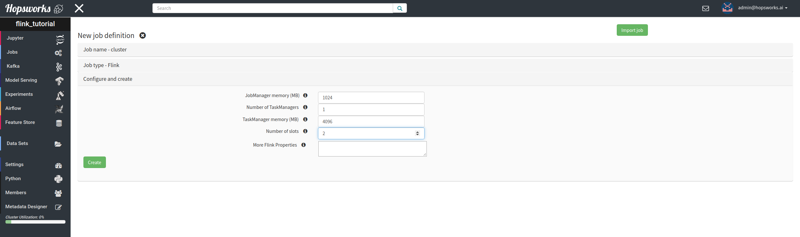
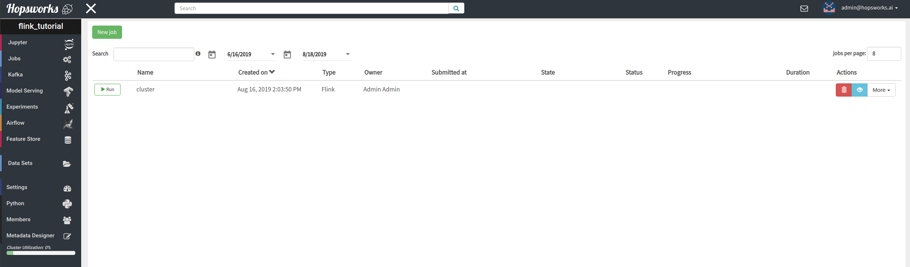
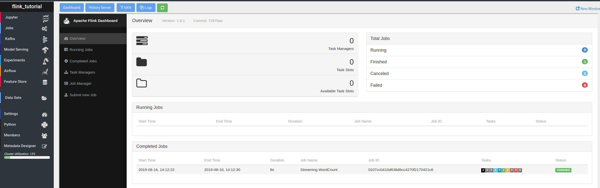
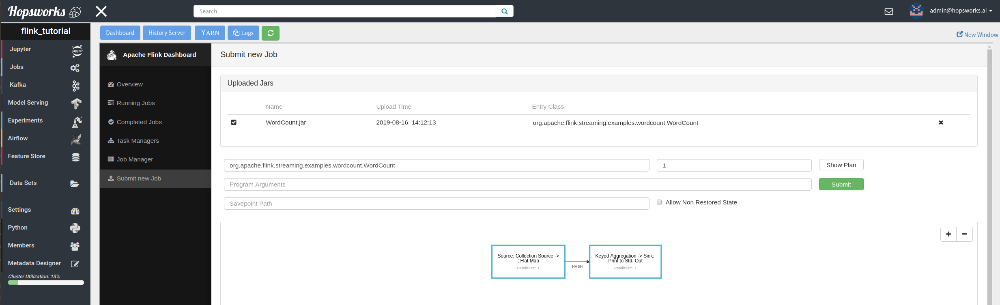
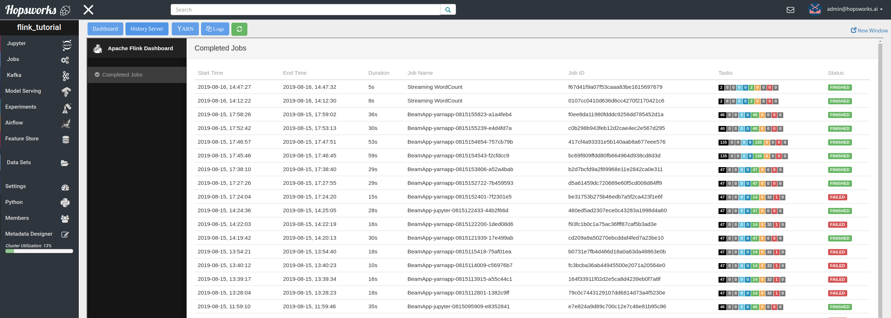
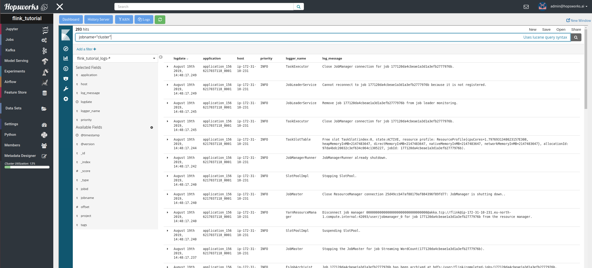
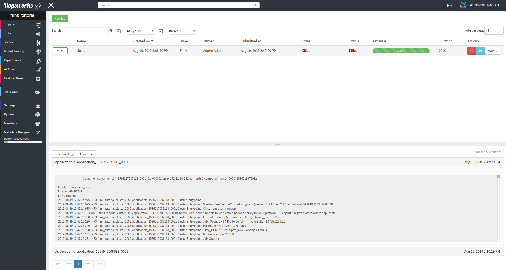

============
Apache Flink
============

Apache Flink is a framework  and distributed processing engine for stateful computations over unbounded and bounded
data streams (link_). Hopsworks supports running Apache Flink jobs as part of the Jobs service within a Hopsworks
project. Running Flink jobs on Hopsworks involves starting a Flink session cluster from the Hopsworks UI and then
submitting jobs via the Flink Dashboard which is accessible through the project's Jobs menu. Hopsworks takes care of
managing the life-cycle of the cluster; deploying, monitoring, cleanup. We go in details in the next sections on how to:

- Start a Flink session cluster and access the Flink Dashboard to run a job
- Submit Flink jobs programmatically
- Access the Flink History server
- Do free text search on Flink JobManager and TaskManager logs

.. _link: https://flink.apache.org/flink-architecture.html

How to run a Flink job
----------------------

Hopsworks supports running long running Flink session clusters in a project-based multi-tenant environment. First,
you need to create the Flink session cluster which is done is the same way as creating a Spark/PySpark job. Navigate
to the project, then select ``Jobs`` from the left hand side menu and then step through the ``New Job wizard`` by
clicking on the ``New`` button. The parameters that can be set for the session cluster are:

- JobManager memory
- Number of TaskManagers
- TaskManager memory
- Number of slots
- Flink properties

For details on how to use these settings and which additional Flink configuration properties you can set through the
``Flink properties`` option, see here_.

.. _here: https://ci.apache.org/projects/flink/flink-docs-stable/ops/config.html

.. _flink_new_job.png: ../../_images/flink_new_job.png

After clicking ``Create``, you should be able to see the new Flink session cluster as depicted in the image below and
you can start it by clicking on the ``Run`` button.

.. _flink_jobs_view.png: ../../_images/flink_jobs_view.png

The cluster will soon be running and then you can access the Flink Dashboard by clicking on the blue button on the
right of the screen. Then you can see the Dashboard from within the project as shown in the image below.

.. _flink_dashboard_1.png: ../../_images/flink_dashboard_1.png

You can then use the Flink Dashboard to submit new jobs by navigating to the ``Submit new Job`` menu. An example for
running a streaming WordCount is the following

.. _flink_wordcount.png: ../../_images/flink_wordcount.png

Submitting jobs programmatically
--------------------------------

The Flink Dashboard uses the Flink Monitoring REST API_ to manage the cluster. Hopsworks exposes this API to the
client through an http proxy, which enables Hopsworks to provide secure multi-tenant access to Flink clusters.
Therefore, user can submit their Flink jobs, typically jar files, by making http requests to Hopsworks based on the
endpoints the API_ provides.

.. _API: https://ci.apache.org/projects/flink/flink-docs-stable/monitoring/rest_api.html
.. _flinkclient: https://github.com/logicalclocks/hops-examples

Hopsworks comes with a Python based client that enables users to submit their Flink programs to Hopsworks
remotely without having to usethe Hopsworks UI. Instructions how to use the Hopsworks Flink command-line
client are available at flinkclient_. Job progress can still be monitored from the Hopsworks UI.

Flink History Server
--------------------

Users have access to the Flink history server, which shows jobs that have ran only in projects the user is a member
of, as projects act like sandboxes across data and jobs. The server is accessible from the same menu
as the Dashboard, by clicking on the ``History Server`` button.

.. _flink_history_server.png: ../../_images/flink_history_server.png

Logs
----

Users can access logs of the Flink session cluster JobManager and TaskManager, in real time, by clicking the ``Logs``
 button of the Job UI. These logs are collected in real time from each machine the Flink cluster is deployed at, and
 then users can do free-text search on their Logs from within Hopsworks.

.. _flink_realtime_logs.png: ../../_images/flink_realtime_logs.png

Additionally, users can access the same logs after the Flink session cluster has shut down, by clicking on the Flink job
and navigating to the bottom of the page where both the ``Execution`` and the ``Error`` logs are available. These
logs contain output from the JobManager and the TaskManagers and are collected by Apache Hadoop YARN, where the Flink
session cluster is running on.

.. _flink_yarn_logs.png: ../../_images/flink_yarn_logs.png
