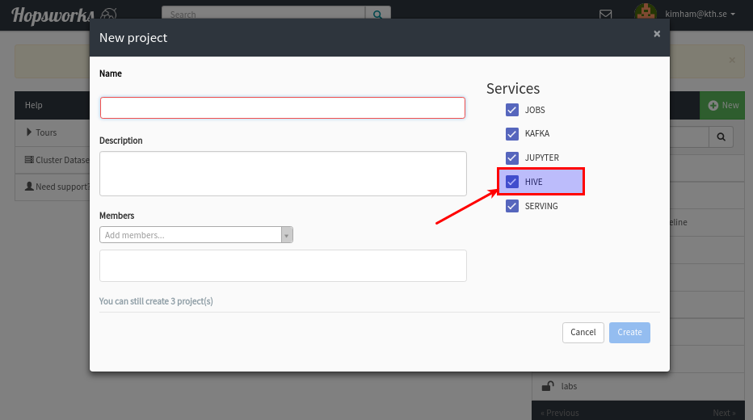

===========
Apache Hive
===========

Introduction
------------

Hopsworks uses a fork_ of Apache Hive that enables users to keep the metadata storage consistent with the filesystem
when a they delete their data, as the metadata describing databases, tables and partitions are deleted as well.

This page serves as a guide on how to use Hive from within Hopsworks. For information on how to write HiveQL (the
language used to query the data) and configuration parameters available for tweaking, please refer to the Apache Hive
wiki_.

.. _wiki: https://cwiki.apache.org/confluence/display/Hive/Home
.. _fork: https://github.com/logicalclocks/hive

Using Hive with Hopsworks
-------------------------

In order to use Hive from Hopsworks, users first need to create a database. Each project that is created with the Hive service enabled gets a Hive database. Users can enable the Hive service either when creating a new project or via the *Settings* section.

.. _hive1.png: ../../_images/hive1.png

Once the database is created, users are able to see in the *Datasets* view a new dataset called ``projectName.db``. This new dataset is the Hive database for the project and contains Hive's data.

.. _hive2.png: ../../_images/hive2.png
.. figure:: ../../imgs/hive2.png
    :alt: Hive database dataset in Hopsworks
    :target: `hive2.png`_
    :align: center
    :figclass: align-center

There are two ways to run queries against Hive. From within Hopsworks using Jupyter notebooks or by using an
    external client to submit queries with a Java client via JDBC:

- Using ``SparkSQL`` inside *Jobs* or *Jupyter Notebooks*
- Using an external Java/JDBC client

Hive Workflow example
~~~~~~~~~~~~~~~~~~~~~

The following is an example of a standard workflow when using Hive. Depending on where users plan to run the queries
from, they can refer to the ``Running Queries using SparkSQL`` or ``Running Queries using Java/JDBC`` sections below.

The steps are: get the raw data into Hopsworks, load the data into Hive, convert the data in a more storage and
computationally efficient format, such as *ORC*, and finally query the new table.

1. **Load the raw data into Hopsworks**: The easiest way to do it is to create a new dataset within the project and
upload the data. Please remember not to generate the ``README.md`` file (or delete it after creating the dataset).
This is because when creating the external table on the dataset, Hive will use all the files contained in the
directory, README.me included if present. An alternative approach would be to create a directory inside the dataset and
point Hive to that directory.

2. **Make Hive aware of the raw data**: To load the data into Hive, users can run the following query.

An example of query can be the following::

    create external table sales(
      street string,
      city string,
      zip int,
      state string,
      beds int,
      baths int,
      sq__ft float,
      sales_type string,
      sale_date string,
      price float,
      latitude float,
      longitude float)
    ROW FORMAT DELIMITED
    FIELDS TERMINATED BY ','
    LOCATION '/Projects/hivedoc/RawData'

The above query assumes that the data is in CSV format and stored in a ``RawData`` dataset within the ``hivedoc`` project. More about the different formats supported by Hive and HiveQL can be found in the Hive wiki_.

3. **Convert data in a more storage and computationaly efficient format** : CSV is not the best option when it comes to execute analytic queries. A better format would be ORC which compresses the data and stores it in a columnar oriented format. More about ORC here_.
To convert the data users have to first create a new table::

    create table orc_table (
      street string,
      city string,
      zip int,
      state string,
      beds int,
      baths int,
      sq__ft float,
      sales_type string,
      sale_date string,
      price float,
      latitude float,
      longitude float)
    STORED AS ORC

The above table is a managed table without any specified location, this means that the table data will be managed by Hive and users will be able to access it in the ``projectName.db`` dataset.
More complex data organization can be achieved by partitioning the table by one or multiple columns, or by using the bucketing feature. All the information about these options is available in the Hive wiki_.

The next step is to convert the data from CSV to ORC, to do that users can run the following query::

  insert overwrite table orc_table select * from sales

4. *Query the data*: finally the data is efficiently loaded into Hive and ready to be queried.

.. _here: https://orc.apache.org/

Session based configuration
~~~~~~~~~~~~~~~~~~~~~~~~~~~

Hive default configuration cannot be modified by users. What they can do though is change the values of certain configuration parameters for their sessions.
Example: By default Hive is configured to not allow dynamic partitions, this means that the query shown previously at point *3* that inserts the data in the new table **will** fail.
To enable dynamic partitioning we need to set ``hive.exec.dynamic.partition.mode`` to be ``nostrict``.
To do that users can execute the following statement, either in the PySpark notebook or in a Java/JDBC client
::

  set hive.exec.dynamic.partition.mode=nostrict

This would enable dynamic partitioning for that session, other users will not be affected by this setting.

All the parameters that can be set or modified are listed in the Hive wiki under `Tez <https://cwiki.apache.org/confluence/display/Hive/Configuration+Properties#ConfigurationProperties-Tez>`_.

Try it out
~~~~~~~~~~

To try out Hive on Hopsworks, users can download a sample notebook_ or the Java client_ and a csv file_ containing
sample data, create a dataset (without README) and upload the data.

.. _client: https://github.com/logicalclocks/hops-examples/blob/master/hive/src/main/java/io/hops/examples/hive/HiveJDBCClient.java
.. _file: http://snurran.sics.se/hops/hive/Sacramentorealestatetransactions.csv

Running Queries using SparkSQL
------------------------------

Users can execute queries against their Hive database using SparkSQL. The spark configuration for Hive is set up
automatically when you create a Jupyter notebook. To view all tables in your project's Hive database with PySpark
inside a Jupyter
notebook, run:

.. code-block:: python

    from hops import hdfs as hopsfs
    PROJECT_NAME = hopsfs.project_name()

    spark.sql("use " + PROJECT_NAME)
    spark.sql("show tables").show()

When you start Jupyter notebooks on Hopsworks, the spark session is automatically created for you with Hive enabled.
 If you are running Spark jobs on Hopsworks, you need to enable Hive in your spark session as follows:

.. code-block:: scala

    val spark = SparkSession.builder().config(sparkConf).enableHiveSupport().getOrCreate()

Here is an example notebook_ that shows more advanced queries.

Running Queries using Java/JDBC
-------------------------------

Users can execute queries remotely against their Hopsworks Hive database by using an Java/JDBC client. An example
with instructions on how to set up and run the remote_ client is available on our hops-examples_ github repo.

.. _remote: https://github.com/logicalclocks/hops-examples/blob/master/hive/src/main/java/io/hops/examples/hive/HiveJDBCClient.java
.. _hops-examples: https://github.com/logicalclocks/hops-examples#hive

LLAP Admin
----------
LLAP stands for *Live long and process*. It's a cluster of long living daemons ready to be used by Hive to read data
from the filesystem and to process query fragments. Hopsworks Admin users have the possibility of managing the
lifecycle of the LLAP cluster. They can start and stop the LLAP cluster from the admin UI. In the admin UI they have
the possibility of specifying the number of instances, the amount of memory each instance should get for the LLAP
executors running inside the instance, the amount of memory for the cache and how many threads to use for the
executors and for the IO.

Normal users can by default use the LLAP cluster in all the projects. By default Hive decides which fragments of the
query execute on the LLAP cluster and which in a separate container. Users can change this behavior by changing the
session based configuration as explained above.

.. _notebook: https://github.com/logicalclocks/hops-examples/blob/master/notebooks/spark/PySparkWithHive.ipynb
