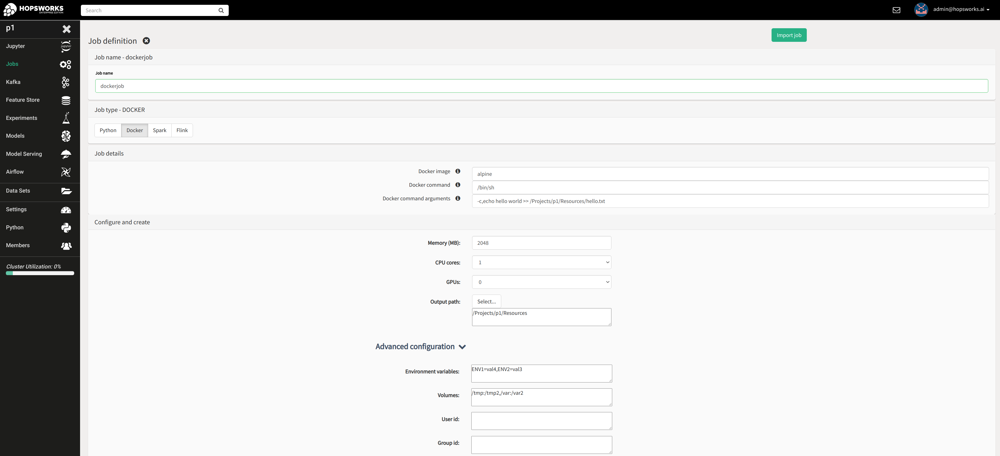

Jobs
====

Members of a project in Hopsworks, can launch the following types of applications through a project's Jobs service:

* Python (*Hopsworks Enterprise only*)
* Apache Spark
* Apache Flink

If you are a beginner it is **highly** recommended to click on the ``Spark``
button at landing page under the available tours. It will guide you through launching your
first Spark application and the steps for launching any job type are similar. Details on running Python programs
are provided in the Python section below.

.. _guided_tours.png: ../../_images/guided_tours.png
.. figure:: ../../imgs/guided_tours.png
    :alt: Guided tours
    :target: `guided_tours.png`_
    :align: center
    :figclass: align-center

To create a new job, click on the ``Jobs`` tab from the Project Menu and
follow the steps below:

* Step 1: Press the ``New Job`` button on the top left corner
* Step 2: Give a name for you job
* Step 3: Select one of the available job types
* Step 4: Select the executable file of your job that you have uploaded earlier in a Dataset
* Step 5: If the job is a Spark job the main class will be inferred from the jar, but can also be set manually
* Step 6 (Optional): Configure default arguments to run your job with
* Step 7: In the *Configure and create* tab you can manually specify
  the configuration you desire for your job and any additional dependencies and arbitrary Spark/Flink
  parameters.
* Step 8: Click on the ``Create`` button
* Step 9: Click on the ``Run`` button to launch your job. If no default arguments have been configured, a dialog textbox will ask for any runtime arguments the job
may require. If this job requires no arguments, the field can be left empty. The figure below shows the dialog.

.. _jobs-ui-args.png: ../../_images/jobs-ui-args.png
.. figure:: ../../imgs/jobs-ui-args.png
    :alt: Job runtime arguments
    :target: `jobs-ui-args.png`_
    :align: center
    :figclass: align-center

    Job input arguments

After creating a job by following the new job wizard, you can manage all jobs and their runs from the landing page of
the Jobs service. The figure below shows a project with 6 jobs where 5 jobs are shown per page. When a job has run
at least once, all past and current runs are then shown in the UI.

.. _jobs-ui.png: ../../_images/jobs-ui.png
.. figure:: ../../imgs/jobs-ui.png
    :alt: Jobs
    :target: `jobs-ui.png`_
    :align: center
    :figclass: align-center

    Jobs UI

Users can interact with the jobs in the following ways:

1. **Search** jobs by using the Search text box
2. **Filter** jobs by creation date
3. Set the **number** of jobs to be displayed **per page**
4. **Run** a job
5. **Stop** a job, this stops **all** the ongoing runs of a job.
6. **Edit** a job, for example change the Spark configuration parameters
7. View **Monitoring UI**, with detailed Job information such as Spark UI, YARN, real-time logs and metrics

.. _jobs-ui-logs.png: ../../_images/jobs-ui-logs.png
.. figure:: ../../imgs/jobs-ui-logs.png
    :alt: Job logs
    :target: `jobs-ui-logs.png`_
    :align: center
    :figclass: align-center

    Job real-time logs

8. View a job's details

.. _jobs-ui-jobdetails.png: ../../_images/jobs-ui-jobdetails.png
.. figure:: ../../imgs/jobs-ui-jobdetails.png
    :alt: Job real-time logs
    :target: `jobs-ui-jobdetails.png`_
    :align: center
    :figclass: align-center

    Job details

9. Make a **copy** of a job

10. **Export** a job, which prompts the user to download a json file. A job can then be imported by clicking on the New
Job and then Import Job button.

Additionally, users click on a job and view additional information about their runs.

1. **Information** about the run, such as location of log files and id.
2. **Stop** a run
3. **Monitoring UI** of this particular run
4. **View/Download stdout logs**
5. **View/Download stderr logs**

.. _jobs-ui-exec-logs.png: ../../_images/jobs-ui-exec-logs.png
.. figure:: ../../imgs/jobs-ui-exec-logs.png
    :alt: Job logs
    :target: `jobs-ui-exec-logs.png`_
    :align: center
    :figclass: align-center

    Job aggregated logs

By default all files and folders created by `Spark` are group writable (i.e umask=007). If you want to change this
default `umask` you can add additional spark property ``spark.hadoop.fs.permissions.umask-mode=<umask>`` in `More Spark Properties` when you create a new job.

Python
------
(*Available in Hopsworks Enterprise only*)

There are three ways of running Python programs in Hopsworks:

* Jupyter notebooks: Covered in the Jupyter section of the user guide.
* Jobs UI
* Programmatically

The GIF below demonstrates how to create a Python job from the **Jobs UI** by selecting a python file that is already
uploaded in a Hopsworks dataset and attaching a few other files to be immediately available to the application at
runtime. However, any file can be made available to the application at runtime by using in the Python app to run, the
``copy_to_local`` function of the ``hdfs`` module of the ``hops`` Python library
http://hops-py.logicalclocks.com/hops.html#module-hops.hdfs

.. _python-new-job.gif: ../../_images/python-new-job.gif
.. figure:: ../../imgs/python-new-job.gif
    :alt: Python new job UI
    :target: `python-new-job.gif`_
    :align: center
    :figclass: align-center

    Create a new Python job from the Jobs UI

You do not have to upload the Python program UI to run it. That can be done so from within the Python program by using
``upload`` function of the ``dataset`` module of the ``hops`` Python library http://hops-py.logicalclocks.com

To do that, first generate an API key for your project, see :ref:`Generate an API key<api-key-generate>`,
and then use the ``project.connect()`` function of the same
library to connect to a project of your Hopsworks cluster and then ``dataset.upload``.

Docker
------
(*Available in Hopsworks Enterprise only*)

The Docker job type in Hopsworks enables running your own Docker containers as jobs in Hopsworks. With the Docker job type, users are no longer restricted in
running only Python, Spark/PySpark and Flink programs, but can now utilize the Hopsworks Jobs service to run any program/service does it packaged in a Docker container.

As seen the screenshot below, users can set the following Docker job specific properties (advanced properties are optional):

- Docker image: The location of the Docker image. Currently only publicly accessible docker registries are supported.
- Docker command: The command to run the Docker container with
- Docker command arguments: Comma-separated list of input arguments of the Docker command
- Output path: The location in Hopsworks datasets where the output of the Job will be persisted, if the programs running inside the container redirect their output
  to the same container-local path. For example, if the output path is set to `/Projects/myproject/Resources` and the a container runs the command `echo "hello" >> /Projects/myproject/Resources/hello.txt`,
  then the Hopsworks job upon job completion will copy the entire content of the `/Projects/myproject/Resources` from the docker container to the corresponding path with the same name under Datasets.
- Environment variables: Comma-separated list of environment variables to be set for the Docker container.
- Volumes: Comma-separated list of volumes to be mounted with the Docker job.
- User id / Group Id: Provide the uid and gid to run the Docker container with. For further details, look into the *Admin options* below.

.. _docker_job_details.png: ../../_images/docker_job_details.png

    Create a new Docker job from the Jobs UI

**Admin options**

The following options can be set using the Variables service within the Admin UI of Hopsworks:

- docker_job_mounts_list: Comma-separated list of host paths jobs are allowed to mount. Default is empty.
- docker_job_mounts_allowed: Whether mounting volumes is allowed. Allowed values: `true/false`. Default is `false`.
- docker_job_uid_strict: Enable or disable strict mode for uig/gid of docker jobs. In strict mode, users cannot set the uid/gid of the job. Default is `true`.
  If `false` and users do not set uid and gid, the container will run with the uid/gid set in the Dockerfile.

Hopsworks IDE Plugin
--------------------

It is also possible to work on jobs while developing in your IntelliJ/PyCharm IDE by installing the Hopsworks Plugin from the marketplace.

**Usage**

-   Open the **Hopsworks Job Preferences** UI for specifying user preferences under **Settings -> Tools -> Hopsworks Job Preferences**.
-   Input the Hopworks project preferences and job details you wish to work on.
-   Open a Project and within the Project Explorer right click on the program ( .jar, .py, .ipynb) you wish to execute as a job on Hopsworks. Different job actions possible are available in the context menu ( Create, Run, Stop, etc.)
- **Note:** The Job Type ``Python`` only supports Hopsworks-EE 

**Actions**

- **Create:** Create or update job as specified in Hopsworks Job Preferences
- **Run:** Uploads the program first to the HDFS path as specficied and runs job 
- **Stop:** Stops a job
- **Delete:** Deletes a job
- **Job Execution Status / Job Execution Logs:** Get the job status or logs respectively. You have the option of retrieving a particular job execution by specifying the execution id in the 'Hopsworks Job Preferences' UI, otherwise default is the last execution for the job name specified. 

.. _pluginHelp.gif: ../../_images/pluginHelp.gif
.. figure:: ../../imgs/pluginHelp.gif
    :alt: Hopworks Plugin
    :target: `pluginHelp.gif`_
    :align: center
    :figclass: align-center

    Working with jobs from Hopsworks IntelliJ/PyCharm plugin