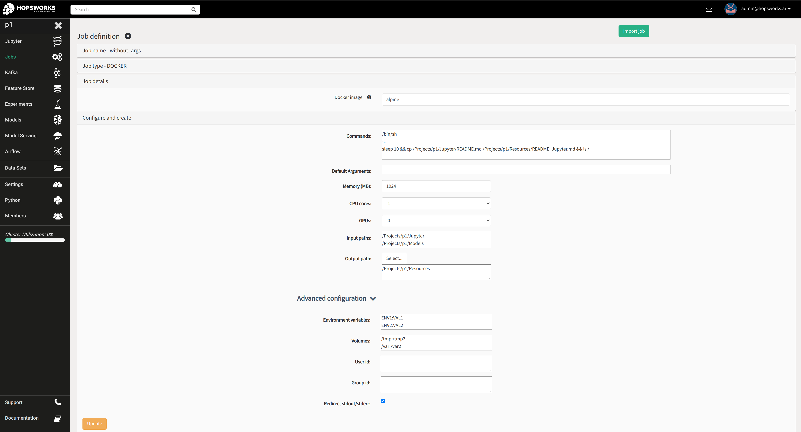
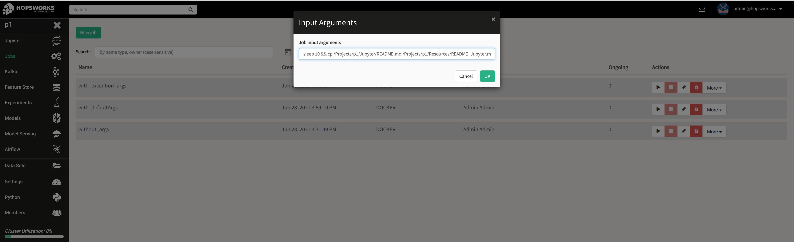
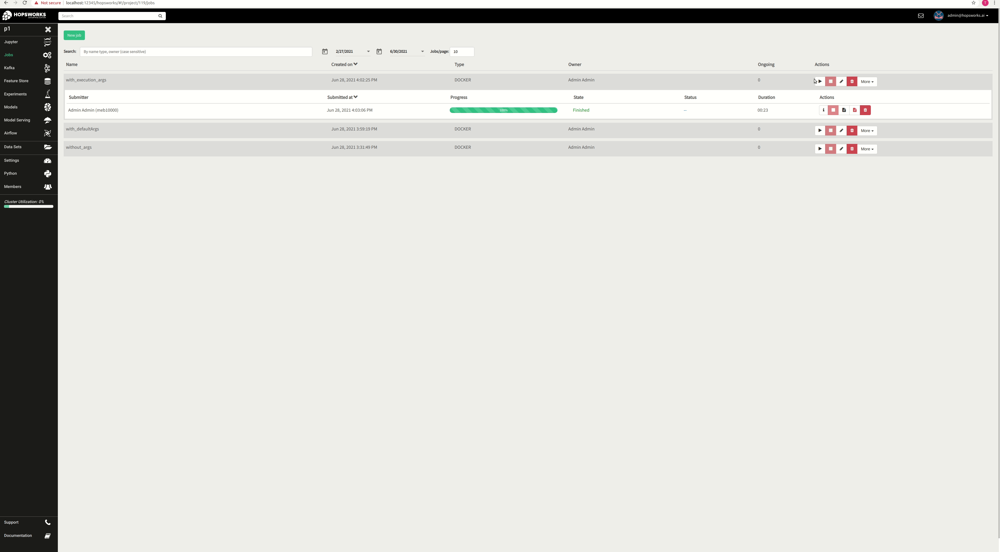

Jobs
====

Python
------
The documentation for the Python jobs has moved to https://docs.hopsworks.ai

Spark
-----

The documentation for the Spark jobs has moved to https://docs.hopsworks.ai

Docker
------
(*Available in Hopsworks Enterprise only*)

The Docker job type in Hopsworks enables running your own Docker containers as jobs in Hopsworks. With the Docker job type, users are no longer restricted in
running only Python, Spark/PySpark and Flink programs, but can now utilize the Hopsworks Jobs service to run any program/service does it packaged in a Docker container.

As seen the screenshot below, users can set the following Docker job specific properties (advanced properties are optional):

- Docker image: The location of the Docker image. Currently only publicly accessible docker registries are supported.
- Docker command: Newline delimited list of commands to run the docker image with.
- Default arguments: Optional input arguments to be provided to the docker container.
- Input paths: Newline delimited list of datasets or directories to be made available to the docker container. Data is copied asynchronously in the container, it is up to the application to wait until all data copy is completed. In the example screenshot below, the application sleeps for 20 seconds before using the data.
- Output path: The location in Hopsworks datasets where the output of the Job will be persisted, if the programs running inside the container redirect their output
  to the same container-local path. For example, if the output path is set to `/Projects/myproject/Resources` and the a container runs the command `echo "hello" >> /Projects/myproject/Resources/hello.txt`,
  then the Hopsworks job upon job completion will copy the entire content of the `/Projects/myproject/Resources` from the docker container to the corresponding path with the same name under Datasets.
- Environment variables: Newline delimited list of environment variables to be set for the Docker container.
- Volumes: Newline delimited list of volumes to be mounted with the Docker job.
- User id / Group Id: Provide the uid and gid to run the Docker container with. For further details, look into the *Admin options* below.
- Redirect stdout/stderr: Whether to automatically redirect stdout and stderr to the Logs dataset. Logs will be made available after the job is completed. Disable this setting if you prefer to redirect the logs to another location.

**Admin options**

The following options can be set using the Variables service within the Admin UI of Hopsworks:

- docker_job_mounts_list: Comma-separated list of host paths jobs are allowed to mount. Default is empty.
- docker_job_mounts_allowed: Whether mounting volumes is allowed. Allowed values: `true/false`. Default is `false`.
- docker_job_uid_strict: Enable or disable strict mode for uig/gid of docker jobs. In strict mode, users cannot set the uid/gid of the job. Default is `true`.
  If `false` and users do not set uid and gid, the container will run with the uid/gid set in the Dockerfile.

Examples
========

Below you can find some examples showing how to set various Docker job options. Despite all jobs using commands and arguments differently, the output of all jobs is the equivalent.
You can choose whichever setup is convenient for your use-case, keep in mind that `defaultArgs` and execution `args` are provided in a single line (String variable).
**If the job fails and no out/error logs are available, make sure the commands and arguments are properly formatted, for example not trailing whitespace characters are present**.

The command to run is `/bin/sh -c sleep 10 && cp /Projects/p1/Jupyter/README.md /Projects/p1/Resources/README_Jupyter.md && ls /`

**Example 1: A job with multiple commands and no arguments**

.. _docker_job_example1.png: ../../_images/docker_job_example1.png

    Create a new Docker job from the Jobs UI using only the "command" property

**Example 2: A job with multiple commands and default arguments**

.. _docker_job_example2.png: ../../_images/docker_job_example2.png

    Create a new Docker job from the Jobs UI using only the "command" and "defaultArgs" properties

**Example 3: A job with multiple commands and no arguments (requested upon execution)**

.. _docker_job_example3.png: ../../_images/docker_job_example3.png

    Create a new Docker job from the Jobs UI using the "command" property and execution arguments

Below you can see how to view the stdout and stderr job logs.

.. _docker_job_logs.gif: ../../_images/docker_job_logs.gif

    View Docker jobs logs

Hopsworks IDE Plugin
--------------------

It is also possible to work on jobs while developing in your IntelliJ/PyCharm IDE by installing the Hopsworks Plugin from the marketplace.

**Usage**

-   Open the **Hopsworks Job Preferences** UI for specifying user preferences under **Settings -> Tools -> Hopsworks Job Preferences**.
-   Input the Hopworks project preferences and job details you wish to work on.
-   Open a Project and within the Project Explorer right click on the program ( .jar, .py, .ipynb) you wish to execute as a job on Hopsworks. Different job actions possible are available in the context menu ( Create, Run, Stop, etc.)
- **Note:** The Job Type ``Python`` only supports Hopsworks-EE 

**Actions**

- **Create:** Create or update job as specified in Hopsworks Job Preferences
- **Run:** Uploads the program first to the HDFS path as specficied and runs job 
- **Stop:** Stops a job
- **Delete:** Deletes a job
- **Job Execution Status / Job Execution Logs:** Get the job status or logs respectively. You have the option of retrieving a particular job execution by specifying the execution id in the 'Hopsworks Job Preferences' UI, otherwise default is the last execution for the job name specified. 

.. _pluginHelp.gif: ../../_images/pluginHelp.gif
.. figure:: ../../imgs/pluginHelp.gif
    :alt: Hopworks Plugin
    :target: `pluginHelp.gif`_
    :align: center
    :figclass: align-center

    Working with jobs from Hopsworks IntelliJ/PyCharm plugin

**Support for running Flink jobs**

-  You can also submit your local program as a flink job using the
   plugin. Follow the steps to ``Create Job`` to first create a flink
   job in Hopsworks.
-  Then click on ``Run Job``. This will first start a flink cluster if
   there is no active running flink job with same job name. Otherwise it
   will use an active running flink cluster with same job name. Next it
   will upload and submit your program to a running flink cluster.
-  Set your program main class using the ``Main Class`` field in
   preferences. To pass arguments, simply fill it in the
   ``User Arguments``, multiple arguments separated by space. e.g.
   --arg1 a1 --arg2 a2

.. _flink_test_withArgs.gif: ../../_images/flink_test_withArgs.gif
.. figure:: ../../imgs/flink_test_withArgs.gif
    :alt: Example:Submitting Flink Job from plugin
    :target: `flink_test_withArgs.gif`_
    :align: center
    :figclass: align-center

    Example:Submitting Flink Job from plugin