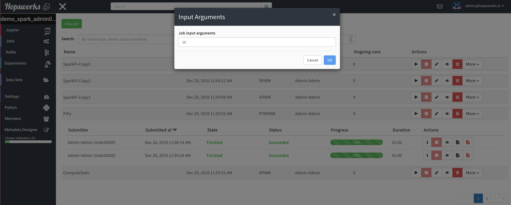
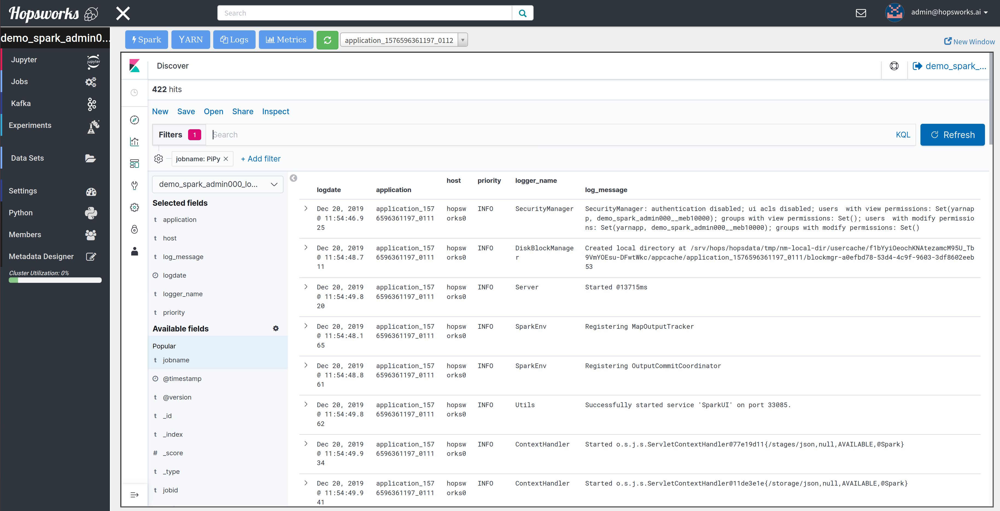
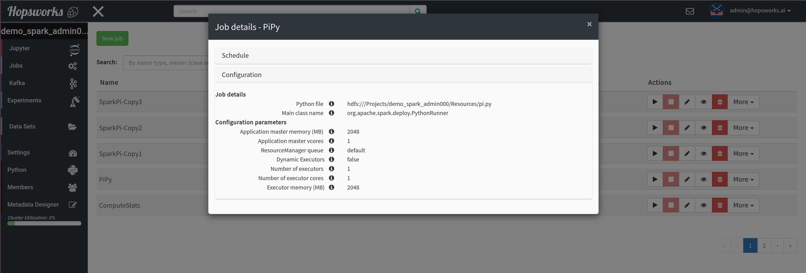
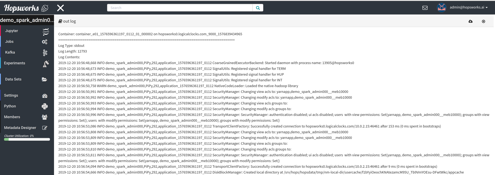
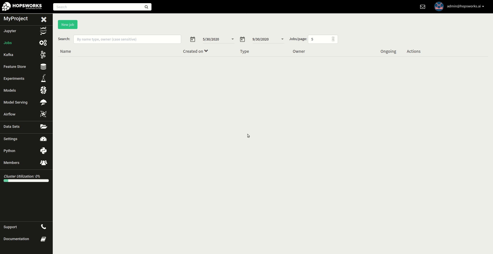

Jobs
====

Members of a project in Hopsworks, can launch the following types of applications through a project's Jobs service:

* Python (*Hopsworks Enterprise only*)
* Apache Spark
* Apache Flink

If you are a beginner it is **highly** recommended to click on the ``Spark``
button at landing page under the available tours. It will guide you through launching your
first Spark application and the steps for launching any job type are similar. Details on running Python programs
are provided in the Python section below.

.. _guided_tours.png: ../../_images/guided_tours.png
.. figure:: ../../imgs/guided_tours.png
    :alt: Guided tours
    :target: `guided_tours.png`_
    :align: center
    :figclass: align-center

To create a new job, click on the ``Jobs`` tab from the Project Menu and
follow the steps below:

* Step 1: Press the ``New Job`` button on the top left corner
* Step 2: Give a name for you job
* Step 3: Select one of the available job types
* Step 4: Select the executable file of your job that you have uploaded earlier in a Dataset
* Step 5 (Optional): Set the main class
* Step 6: In the *Configure and create* tab you can manually specify
  the configuration you desire for your job and any additional dependencies and arbitrary Spark/Flink
  parameters.
* Step 7: Click on the ``Create`` button
* Step 8: Click on the ``Run`` button to launch your job, a dialog textbox will ask for any runtime arguments the job
  may require. If this job requires no arguments, the field can be left empty. The figure below shows the dialog.

.. _jobs-ui-args.png: ../../_images/jobs-ui-args.png

    Job input arguments

After creating a job by following the new job wizard, you can manage all jobs and their runs from the landing page of
the Jobs service. The figure below shows a project with 6 jobs where 5 jobs are shown per page. When a job has run
at least once, all past and current runs are then shown in the UI.

.. _jobs-ui.png: ../../_images/jobs-ui.png
.. figure:: ../../imgs/jobs-ui.png
    :alt: Jobs
    :target: `jobs-ui.png`_
    :align: center
    :figclass: align-center

    Jobs UI

Users can interact with the jobs in the following ways:

1. **Search** jobs by using the Search text box
2. **Filter** jobs by creation date
3. Set the **number** of jobs to be displayed **per page**
4. **Run** a job
5. **Stop** a job, this stops **all** the ongoing runs of a job.
6. **Edit** a job, for example change the Spark configuration parameters
7. View **Monitoring UI**, with detailed Job information such as Spark UI, YARN, real-time logs and metrics

.. _jobs-ui-logs.png: ../../_images/jobs-ui-logs.png

    Job real-time logs

8. View a job's details

.. _jobs-ui-jobdetails.png: ../../_images/jobs-ui-jobdetails.png

    Job details

9. Make a **copy** of a job

10. **Export** a job, which prompts the user to download a json file. A job can then be imported by clicking on the New
Job and then Import Job button.

Additionally, users click on a job and view additional information about their runs.

1. **Information** about the run, such as location of log files and id.
2. **Stop** a run
3. **Monitoring UI** of this particular run
4. **View/Download stdout logs**
5. **View/Download stderr logs**

.. _jobs-ui-exec-logs.png: ../../_images/jobs-ui-exec-logs.png

    Job aggregated logs

Python
------
(*Available in Hopsworks Enterprise only*)

There are three ways of running Python programs in Hopsworks:

* Jupyter notebooks: Covered in the Jupyter section of the user guide.
* Jobs UI
* Programmatically

The GIF below demonstrates how to create a Python job from the **Jobs UI** by selecting a python file that is already
uploaded in a Hopsworks dataset and attaching a few other files to be immediately available to the application at
runtime. However, any file can be made available to the application at runtime by using in the Python app to run, the
``copy_to_local`` function of the ``hdfs`` module of the ``hops`` Python library
http://hops-py.logicalclocks.com/hops.html#module-hops.hdfs

.. _python-new-job.gif: ../../_images/python-new-job.gif

    Create a new Python job from the Jobs UI

You do not have to upload the Python program UI to run it. That can be done so from within the Python program by using
``upload`` function of the ``dataset`` module of the ``hops`` Python library http://hops-py.logicalclocks.com

To do that, first generate an API key for your project, see :ref:`Generate an API key<api-key-generate>`,
and then use the ``project.connect()`` function of the same
library to connect to a project of your Hopsworks cluster and then ``dataset.upload``.
