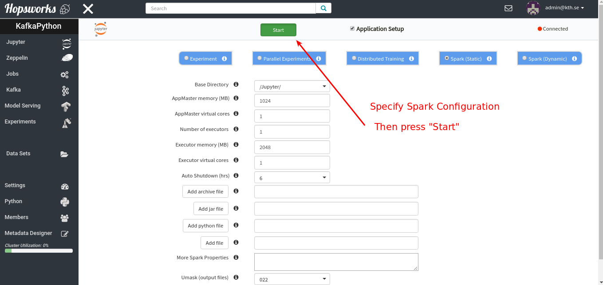

Jupyter Notebooks
=======================

This tutorial will go over the basics of using Jupyter notebooks on Hopsworks.

Jupyter Notebooks Basics
-------------------

**Open the Jupyter Service**

Jupyter is provided as a micro-service on Hopsworks and can be found in the main UI inside a project.

.. _jupyter1.png: ../../_images/jupyter1.png
.. figure:: ../../imgs/jupyter1.png
    :alt: Open the Jupyter service on Hopsworks
    :target: `jupyter1.png`_
    :align: center
    :figclass: align-center

    Open the Jupyter service on Hopsworks

**Start a Jupyter notebook server**

When you start a Jupyter notebook server you have the possibility to specify Spark properties of the notebooks you will create on the server. Hopsworks provides *Machine learning as a service* with tensorflow and spark, supporting distirbuted training, parallel experiments, hyperparameter tuning, and model serving (HopsML). If you are doing machine learning on hops you probably want to select the notebook servers "Experiment", "Parallel Experiment" or "Distributed training" as shown in the figure below. For more information about *HopsML*, see the hops-tensorflow_ documentation. For general purpose notebooks, select the type "Spark (Static)" or "Spark (Dynamic)".

.. _jupyter2.png: ../../_images/jupyter2.png

    Start a Jupyter notebook server

**Jupyter + Spark on Hopsworks**

As a user, you will just interact with the Jupyter notebooks, but if you are interested about the technologies behind it, it is explained below.

When using Jupyter on Hopsworks, a library called `sparkmagic`_ is used to interact with the Hops (hadoop) cluster. When you create a Jupyter notebook on Hopsworks, you first select a **kernel**. A kernel is simply a program that executes the code that you have in the Jupyter cells, you can think of it as a REPL-backend to your jupyter notebook that acts as a frontend.

Sparkmagic works with a remote REST server for Spark, called `livy`_, running inside the Hops cluster. Livy is an interface that Jupyter-on-Hopsworks use to interact with the Hops cluster. When you run Jupyter cells using the pyspark kernel, the kernel will automatically send commands to livy in the background for executing the commands on the cluster. Thus, the work that happens in the background when you run a Jupyter cell is as follows:

- The code in the cell will first go to the kernel.
- Next, the kernel kernel sends the code as a HTTP REST request to livy.
- When receiving the REST request, livy executes the code on the Spark driver in the cluster.
- If the code is regular python/scala/R code, it will be run inside a python/scala/R interpreter on the Spark driver.
- If the code includes a spark command, using the spark session, a spark job will be launched on the cluster from the Spark driver.
- When the python/scala/R or spark execution is finished, the results are sent back from livy to the pyspark kernel/sparkmagic.
- Finally, the pyspark kernel displays the result in the Jupyter notebook.

The three Jupyter kernels we support on Hopsworks are:

- Spark, a kernel for executing scala code and interacting with the cluster through spark-scala
- PySpark, a kernel for executing python code and interacting with the cluster through pyspark
- SparkR, a kernel for executing R code and interacting with the cluster through spark-R

All notebooks make use of Spark, since that is the standard way to allocate resources and run jobs in the cluster.

In the rest of this tutorial we will focus on the pyspark kernel.

Pyspark notebooks
-------------------

**Create a pyspark notebook**

After you have started the Jupyter notebook server, you can create a pyspark notebook from the Jupyter dashboard:

.. _jupyter3.png: ../../_images/jupyter3.png
.. figure:: ../../imgs/jupyter3.png
    :alt: Create a pyspark notebook
    :target: `jupyter3.png`_
    :align: center
    :figclass: align-center

    Create a pyspark notebook

When you execute the first cell in a pyspark notebook, the spark session is automatically created, refering to the Hops cluster.

.. _jupyter4.png: ../../_images/jupyter4.png
.. figure:: ../../imgs/jupyter4.png
    :alt: SparkSession creation with pyspark kernel
    :target: `jupyter4.png`_
    :align: center
    :figclass: align-center

    SparkSession creation with pyspark kernel

The notebook will look just like any python notebook, with the difference that the python interpreter is actually running on a Spark driver in the cluster. You can execute regular python code:

.. _jupyter5.png: ../../_images/jupyter5.png
.. figure:: ../../imgs/jupyter5.png
    :alt: Executing python code on the spark driver in the cluster
    :target: `jupyter5.png`_
    :align: center
    :figclass: align-center

    Executing python code on the spark driver in the cluster

Since you are executing on the spark driver, you can also launch jobs on spark executors in the cluster, the spark session is available as the variable `spark` in the notebook:

.. _jupyter6.png: ../../_images/jupyter6.png
.. figure:: ../../imgs/jupyter6.png
    :alt: Starting a spark job from Jupyter
    :target: `jupyter6.png`_
    :align: center
    :figclass: align-center

    Starting a spark job from Jupyter

When you execute a cell in Jupyter that starts a Spark job, you can go back to the Hopsworks-Jupyter-UI and you will se that a link to the SparkUI for the job have been created.

.. _jupyter11.png: ../../_images/jupyter11.png
.. figure:: ../../imgs/jupyter11.png
    :alt: Opening the SparkUI in Hopsworks
    :target: `jupyter11.png`_
    :align: center
    :figclass: align-center

    Opening the SparkUI in Hopsworks

.. _jupyter12.png: ../../_images/jupyter12.png
.. figure:: ../../imgs/jupyter12.png
    :alt: The SparkUI in Hopsworks
    :target: `jupyter12.png`_
    :align: center
    :figclass: align-center

    The SparkUI in Hopsworks

In addition to having access to a regular python interpreter as well as the spark cluster, you also have access to **magic** commands provided by sparkmagic. You can view a list of all commands by executing a cell with `%%help`:

.. _jupyter7.png: ../../_images/jupyter7.png
.. figure:: ../../imgs/jupyter7.png
    :alt: Printing a list of all sparkmagic commands
    :target: `jupyter7.png`_
    :align: center
    :figclass: align-center

    Printing a list of all sparkmagic commands

Plotting with Pyspark Kernel
-------------------
So far throughout this tutorial, the Jupyter notebook have behaved more or less identical to how it does if you start the notebook server locally on your machine using a python kernel, without access to a Hadoop cluster. However, there is one main difference from a user-standpoint when using pyspark notebooks instead of regular python notebooks, this is related to *plotting*.

Since the code in a pyspark notebook is being executed remotely, in the spark cluster, regular python plotting will not work. What you can do however, is to use sparkmagic to download your remote spark dataframe as a local pandas dataframe and plot it using matplotlib, seaborn, or sparkmagics built in visualization. To do this we use the magics: `%%sql`, `%%spark`, and `%%local`. The steps to do plotting using a pyspark notebook are illustrated below. Using this approach, you can have large scale cluster computation and plotting in the same notebook.

**Step 1 : Create a remote Spark Dataframe**:

.. _jupyter8.png: ../../_images/jupyter8.png
.. figure:: ../../imgs/jupyter8.png
    :alt: Creating a spark dataframe
    :target: `jupyter8.png`_
    :align: center
    :figclass: align-center

    Creating a spark dataframe

**Step 2 : Download the Spark Dataframe to a local Pandas Dataframe using %%sql or %%spark**:

Note: you should **not** try to download large spark dataframes for plotting. When you plot a dataframe, the entire dataframe must fit into memory, so add the flag `--maxrows x` to limit the dataframe size when you download it to the local Jupyter server for plotting.

Using %%sql:

.. _jupyter9.png: ../../_images/jupyter9.png
.. figure:: ../../imgs/jupyter9.png
    :alt: Downloading the spark dataframe to a pandas dataframe using %%sql
    :target: `jupyter9.png`_
    :align: center
    :figclass: align-center

    Downloading the spark dataframe to a pandas dataframe using %%sql

Using %%spark:

.. _jupyter10.png: ../../_images/jupyter10.png
.. figure:: ../../imgs/jupyter10.png
    :alt: Downloading the spark dataframe to a pandas dataframe using %%spark
    :target: `jupyter10.png`_
    :align: center
    :figclass: align-center

    Downloading the spark dataframe to a pandas dataframe using %%spark

**Step 3 : Plot the pandas dataframe using Python plotting libraries**:

When you download a dataframe from spark to pandas with sparkmagic, it gives you a default visualization of the data using autovizwidget, as you saw in the screenshots above. However, sometimes you want custom plots, using matplotlib or seaborn. To do this, use the sparkmagic %%local to access the local pandas dataframe and then you can plot like usual. Just make sure that you have your plotting libraries (e.g matplotlib or seaborn) installed on the Jupyter machine, contact a system administrator if this is not already installed.

.. _jupyter13.png: ../../_images/jupyter13.png
.. figure:: ../../imgs/jupyter13.png
    :alt: Import plotting libraries locally on the Jupyter server
    :target: `jupyter13.png`_
    :align: center
    :figclass: align-center

    Import plotting libraries locally on the Jupyter server

.. _jupyter14.png: ../../_images/jupyter14.png
.. figure:: ../../imgs/jupyter14.png
    :alt: Plot a local pandas dataframe using seaborn and the magic %%local
    :target: `jupyter14.png`_
    :align: center
    :figclass: align-center

    Plot a local pandas dataframe using seaborn and the magic %%local

.. _jupyter15.png: ../../_images/jupyter15.png
.. figure:: ../../imgs/jupyter15.png
    :alt: Plot a local pandas dataframe using matplotlib and the magic %%local
    :target: `jupyter15.png`_
    :align: center
    :figclass: align-center

    Plot a local pandas dataframe using matplotlib and the magic %%local

Want to Learn More?
-------------------

We have provided a large number of example notebooks, available here_, upload them to your project on Hopsworks and try it out! You can also have a look at HopsML (hops-tensorflow_), which enables large-scale distributed deep learning on Hops.

.. _here: https://github.com/logicalclocks/hops-examples
.. _hops-tensorflow: ./tensorflow.html
.. _sparkmagic: https://github.com/jupyter-incubator/sparkmagic
.. _livy: https://github.com/apache/incubator-livy
