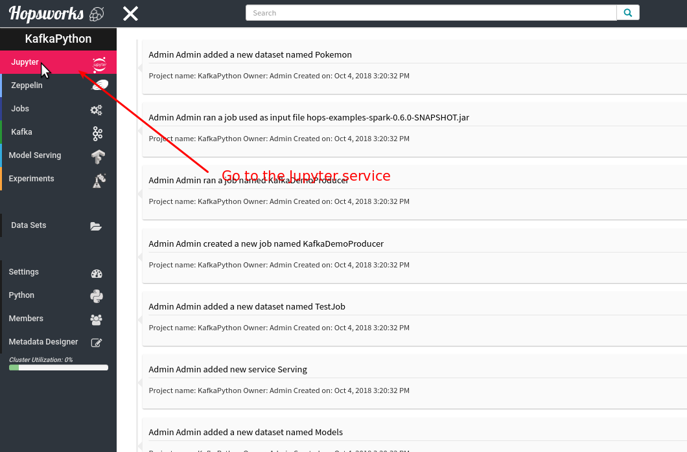
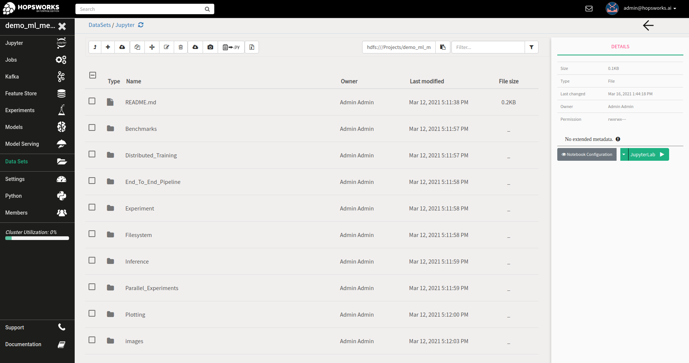
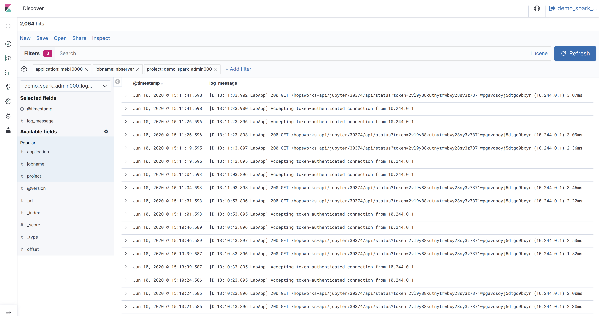
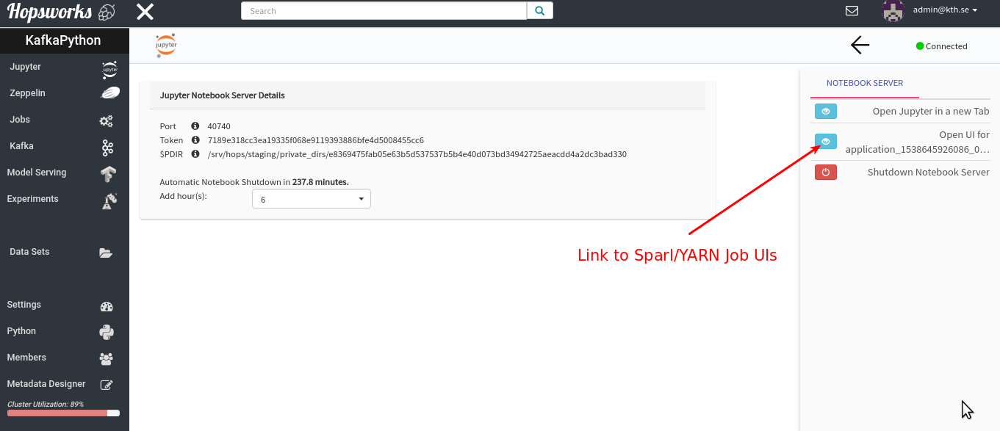
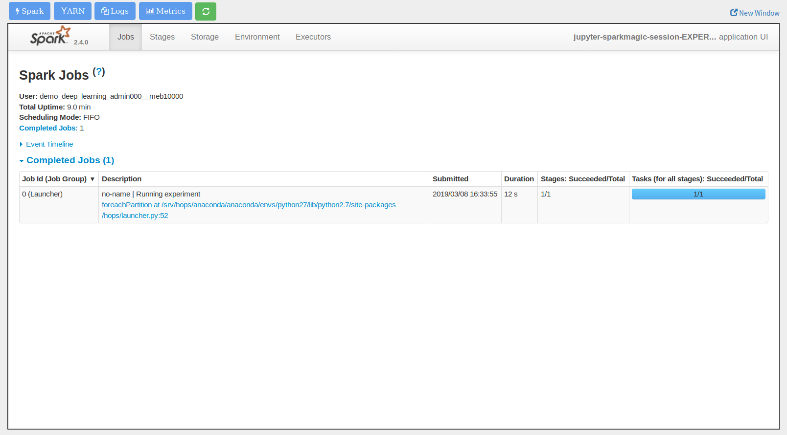
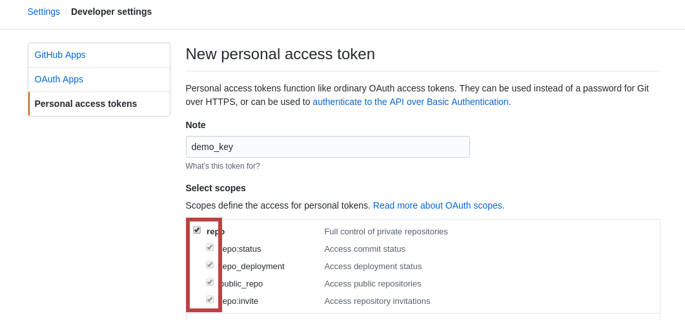
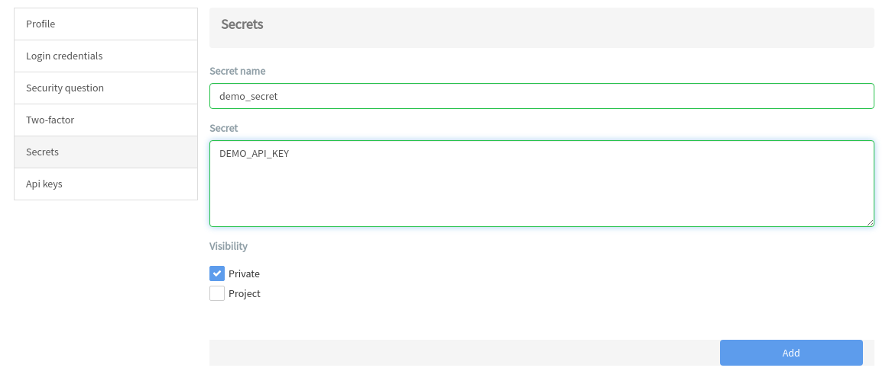
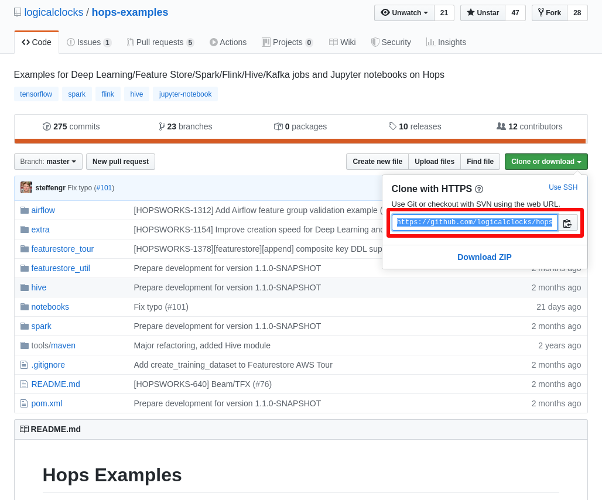
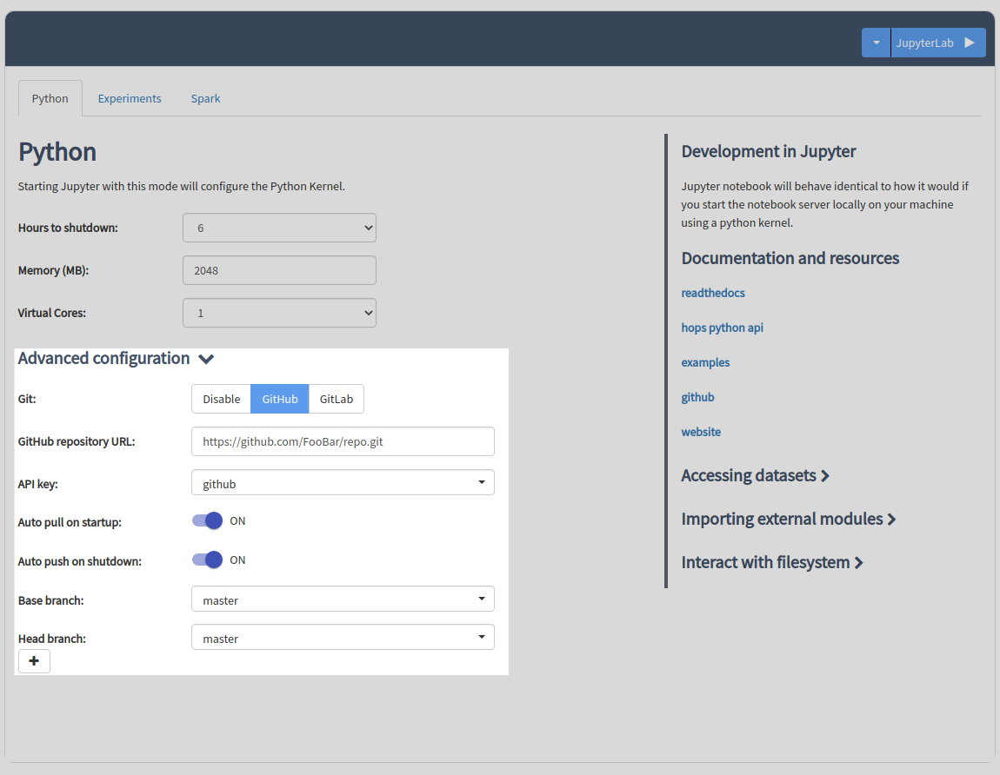
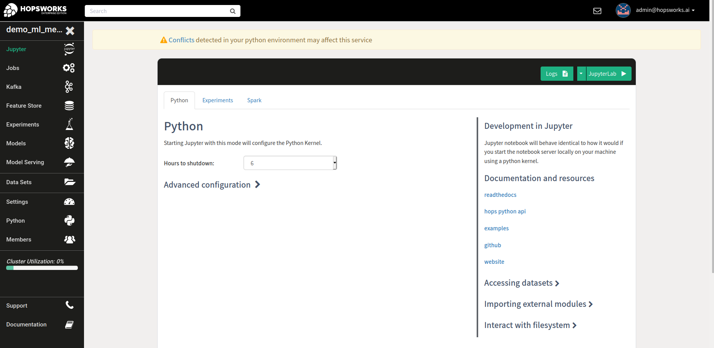

Jupyter Notebooks
=======================

This tutorial will go over the basics of using Jupyter notebooks on Hopsworks.

Jupyter Notebooks Basics
--------------------------------------

**Open the Jupyter Service**

Jupyter is provided as a micro-service on Hopsworks and can be found in the main UI inside a project.

**Start a Jupyter notebook server**

When you start a Jupyter notebook server you can select the 'Python' option, which enables the Python kernel in JupyterLab, the notebook server behaves the same as running Jupyter on your local workstation.

If you are doing Machine Learning you should pick the Experiments tab. See HopsML_ for more information on the Machine Learning pipeline.

For general purpose notebooks, select the Spark tab and run with Static or Dynamic Spark Executors.

Hopsworks supports both JupyterLab and classic Jupyter as Jupyter development frameworks. Clicking `Start` as shown
in the image below, will start JupyterLab by default. You can select to start with classic Jupyter by clicking on
the arrow next to the start button. Also, you can switch from JupyterLab to classic Jupyter from within JupyterLab
and then `Help-Launch Classic Notebook`.

.. _jupyter1.png: ../../_images/jupyter1.png

    Start a Jupyter notebook server

**Using the previous attached configuration**

When you run a notebook, the jupyter configuration used is stored and attached to the notebook as an xattribute. You can
use this configuration later to start the jupyter notebook server directly from the notebook file. When the notebook
you previously run is selected, you will see options to view the previously run configuration or start jupyter server
from the previous configuration. Click on the Notebook Configuration button to view the previous used configuration.
Click on the JupyterLab button to start the jupyter notebook server.

.. _notebook_jupyter_configuration.png: ../../_images/notebook_jupyter_configuration.png

    Start a Jupyter notebook server from the previous configuration attached to notebook.

**Logs**

It can be useful to look at the Jupyter server logs in case of errors as they can provide more details compared to the
error notification that is shown in the Jupyter dashboard. For example if Jupyter cannot start, simply click the
`Logs` button next to the `Start` button in Jupyter dashboard.

This will open a new tab (*make sure your browser does not block the new tab!*) with the Jupyter logs as shown in the
figure below.

.. _jupyter-logs-kibana.png: ../../_images/jupyter-logs-kibana.png

    Jupyter logs UI

**Jupyter + Spark on Hopsworks**

As a user, you will just interact with the Jupyter notebooks, but below you can find a detailed explanation of the technology behind the scenes.

When using Jupyter on Hopsworks, a library called `sparkmagic`_ is used to interact with the Hops cluster. When you create a Jupyter notebook on Hopsworks, you first select a **kernel**. A kernel is simply a program that executes the code that you have in the Jupyter cells, you can think of it as a REPL-backend to your jupyter notebook that acts as a frontend.

Sparkmagic works with a remote REST server for Spark, called `livy`_, running inside the Hops cluster. Livy is an interface that Jupyter-on-Hopsworks uses to interact with the Hops cluster. When you run Jupyter cells using the pyspark kernel, the kernel will automatically send commands to livy in the background for executing the commands on the cluster. Thus, the work that happens in the background when you run a Jupyter cell is as follows:

- The code in the cell will first go to the kernel.
- Next, the kernel kernel sends the code as a HTTP REST request to livy.
- When receiving the REST request, livy executes the code on the Spark driver in the cluster.
- If the code is regular python/scala/R code, it will run inside a python/scala/R interpreter on the Spark driver.
- If the code includes a spark command, using the spark session, a spark job will be launched on the cluster from the Spark driver.
- When the python/scala/R or spark execution is finished, the results are sent back from livy to the pyspark kernel/sparkmagic.
- Finally, the pyspark kernel displays the result in the Jupyter notebook.

The three Jupyter kernels we support on Hopsworks are:

- Spark, a kernel for executing scala code and interacting with the cluster through spark-scala
- PySpark, a kernel for executing python code and interacting with the cluster through pyspark
- SparkR, a kernel for executing R code and interacting with the cluster through spark-R

All notebooks make use of Spark, since that is the standard way to allocate resources and run jobs in the cluster.

By default all files and folders created by `Spark` are group writable (i.e umask=007). If you want to change this
default `umask` you can add additional spark property ``spark.hadoop.fs.permissions.umask-mode=<umask>`` in `More Spark Properties` before starting the jupyter server.

In the rest of this tutorial we will focus on the pyspark kernel.

Pyspark notebooks
-------------------

**Create a pyspark notebook**

After you have started the Jupyter notebook server, you can create a pyspark notebook from the Jupyter dashboard:

.. _jupyter3.png: ../../_images/jupyter3.png
.. figure:: ../../imgs/jupyter3.png
    :alt: Create a pyspark notebook
    :target: `jupyter3.png`_
    :align: center
    :figclass: align-center

    Create a pyspark notebook

When you execute the first cell in a pyspark notebook, the spark session is automatically created, referring to the Hops cluster.

.. _jupyter4.png: ../../_images/jupyter4.png
.. figure:: ../../imgs/jupyter4.png
    :alt: SparkSession creation with pyspark kernel
    :target: `jupyter4.png`_
    :align: center
    :figclass: align-center

    SparkSession creation with pyspark kernel

The notebook will look just like any python notebook, with the difference that the python interpreter is actually running on a Spark driver in the cluster. You can execute regular python code:

.. _jupyter5.png: ../../_images/jupyter5.png
.. figure:: ../../imgs/jupyter5.png
    :alt: Executing python code on the spark driver in the cluster
    :target: `jupyter5.png`_
    :align: center
    :figclass: align-center

    Executing python code on the spark driver in the cluster

Since you are executing on the spark driver, you can also launch jobs on spark executors in the cluster, the spark session is available as the variable `spark` in the notebook:

.. _jupyter6.png: ../../_images/jupyter6.png
.. figure:: ../../imgs/jupyter6.png
    :alt: Starting a spark job from Jupyter
    :target: `jupyter6.png`_
    :align: center
    :figclass: align-center

    Starting a spark job from Jupyter

When you execute a cell in Jupyter that starts a Spark job, you can go back to the Hopsworks-Jupyter-UI and you will see that a link to the SparkUI for the job that has been created.

.. _jupyter11.png: ../../_images/jupyter11.png

    Opening the SparkUI in Hopsworks

.. _jupyter12.png: ../../_images/jupyter12.png

    The SparkUI in Hopsworks

In addition to having access to a regular python interpreter as well as the spark cluster, you also have access to **magic** commands provided by sparkmagic. You can view a list of all commands by executing a cell with `%%help`:

.. _jupyter7.png: ../../_images/jupyter7.png
.. figure:: ../../imgs/jupyter7.png
    :alt: Printing a list of all sparkmagic commands
    :target: `jupyter7.png`_
    :align: center
    :figclass: align-center

    Printing a list of all sparkmagic commands

Plotting with Pyspark Kernel
---------------------------------------------------------
So far throughout this tutorial, the Jupyter notebook have behaved more or less identical to how it does if you start the notebook server locally on your machine using a python kernel, without access to a Hadoop cluster. However, there is one main difference from a user-standpoint when using pyspark notebooks instead of regular python notebooks, this is related to *plotting*.

Since the code in a pyspark notebook is being executed remotely, in the spark cluster, regular python plotting will not work. What you can do however, is to use sparkmagic to download your remote spark dataframe as a local pandas dataframe and plot it using matplotlib, seaborn, or sparkmagics built in visualization. To do this we use the magics: `%%sql`, `%%spark`, and `%%local`. The steps to do plotting using a pyspark notebook are illustrated below. Using this approach, you can have large scale cluster computation and plotting in the same notebook.

**Step 1 : Create a remote Spark Dataframe**:

.. _jupyter8.png: ../../_images/jupyter8.png
.. figure:: ../../imgs/jupyter8.png
    :alt: Creating a spark dataframe
    :target: `jupyter8.png`_
    :align: center
    :figclass: align-center

    Creating a spark dataframe

**Step 2 : Download the Spark Dataframe to a local Pandas Dataframe using %%sql or %%spark**:

**Note:** you should **not** try to download large spark dataframes for plotting. When you plot a dataframe, the entire dataframe must fit into memory, so add the flag `--maxrows x` to limit the dataframe size when you download it to the local Jupyter server for plotting.

Using %%sql:

.. _jupyter9.png: ../../_images/jupyter9.png
.. figure:: ../../imgs/jupyter9.png
    :alt: Downloading the spark dataframe to a pandas dataframe using %%sql
    :target: `jupyter9.png`_
    :align: center
    :figclass: align-center

    Downloading the spark dataframe to a pandas dataframe using %%sql

Using %%spark:

.. _jupyter10.png: ../../_images/jupyter10.png
.. figure:: ../../imgs/jupyter10.png
    :alt: Downloading the spark dataframe to a pandas dataframe using %%spark
    :target: `jupyter10.png`_
    :align: center
    :figclass: align-center

    Downloading the spark dataframe to a pandas dataframe using %%spark

**Step 3 : Plot the pandas dataframe using Python plotting libraries**:

When you download a dataframe from spark to pandas with sparkmagic, it gives you a default visualization of the data using autovizwidget, as you saw in the screenshots above. However, sometimes you want custom plots, using matplotlib or seaborn. To do this, use the sparkmagic %%local to access the local pandas dataframe and then you can plot like usual. Just make sure that you have your plotting libraries (e.g matplotlib or seaborn) installed on the Jupyter machine, contact a system administrator if this is not already installed.

.. _jupyter13.png: ../../_images/jupyter13.png
.. figure:: ../../imgs/jupyter13.png
    :alt: Import plotting libraries locally on the Jupyter server
    :target: `jupyter13.png`_
    :align: center
    :figclass: align-center

    Import plotting libraries locally on the Jupyter server

.. _jupyter14.png: ../../_images/jupyter14.png
.. figure:: ../../imgs/jupyter14.png
    :alt: Plot a local pandas dataframe using seaborn and the magic %%local
    :target: `jupyter14.png`_
    :align: center
    :figclass: align-center

    Plot a local pandas dataframe using seaborn and the magic %%local

.. _jupyter15.png: ../../_images/jupyter15.png
.. figure:: ../../imgs/jupyter15.png
    :alt: Plot a local pandas dataframe using matplotlib and the magic %%local
    :target: `jupyter15.png`_
    :align: center
    :figclass: align-center

    Plot a local pandas dataframe using matplotlib and the magic %%local

Jupyter notebooks with version control
--------------------------------------

Jupyter notebooks have become the lingua franca for data scientists. As with ordinary source code files, we should version them
to be able to keep track of the changes we made or collaborate.

**Hopsworks Enterprise Edition** comes with a feature to allow users to version their notebooks with Git and interact with remote repositories such as
GitHub ones. Authenticating against a remote service is done using API keys which are safely stored in Hopsworks.

Getting an API key
~~~~~~~~~~~~~~~~~~

The first thing we need to do is issue an API key from a remote hosting service. For the purpose of this guide it will be GitHub.
To do so, go to your **Settings** > **Developer Settings** > **Personal access tokens**

Then click on **Generate new token**. Give a distinctive name to the token and select all repo scopes. Finally hit the **Generate token button**.
For more detailed instructions follow `GitHub Help <https://help.github.com/en/github/authenticating-to-github/creating-a-personal-access-token-for-the-command-line>`_.

.. _github_api_key.png: ../../_images/github_api_key.png

    Issuing an API key from GitHub

**NOTE:** Make sure you copy the token, if you lose it there is no way to recover, you have to go through the steps again

Storing API key to Hopsworks
~~~~~~~~~~~~~~~~~~~~~~~~~~~~

Once we have issued an API key, we need to store it in Hopsworks for later usage. For this purpose we will use the *Secrets* which
store encrypted information accessible only to the owner of the secret. If you wish to, you can share the same secret API key with
all the members of a Project.

Go to your account’s **Settings** on the top right corner and click **Secrets**.
Give a name to the secret, paste the API token from the previous step and finally click **Add**.

.. _hopsworks_secrets.png: ../../_images/hopsworks_secrets.png

    Storing the API key as secret in Hopsworks

Starting Jupyter with Git
~~~~~~~~~~~~~~~~~~~~~~~~~

To start versioning your Jupyter notebooks is quite trivial. First copy the web URL of your repository from GitHub or GitLab.

.. _github_copy_url.png: ../../_images/_github_copy_url.png

    Copy repository web URL from GitHub

Navigate into a Project and head over to Jupyter from the left panel. Regardless of the mode, Git options are the same. For
brevity, here we use Python mode. Expand the **Advanced configuration** and enable **Git** by choosing **GITHUB** or **GITLAB**, here we use GitHub. More options will appear as shown in figure
below. Paste the repository's web URL from the previous step into *GitHub repository URL* and from the *API key* dropdown select
the name of the *Secret* you entered.

.. _launch_jupyter_git.png: ../../_images/launch_jupyter_git.svg

    Launching JupyterLab with Git integration

Keep in mind that once you've enabled Git, you will **no longer be able** to see notebooks stored in HDFS and vice versa. Notebooks
versioned with Git will **not** be visible in Datasets browser. Another important note is that if you are running Jupyter Servers on Kubernetes
and Git is enabled, notebooks are stored in the pod's local filesystem. So, if you stop Jupyter or the pod gets killed and you haven't **pushed**,
your modifications will be lost.

That’s the minimum configuration you should have. It will pick the default branch you've set in GitHub and set it as *base* and *head* branch.
By default it will automatically **pull** from *base* on Jupyter startup and **push** to *head* on Jupyter shutdown.
You can change this behaviour by toggling the respective switches. Click on the *plus button* to create a new branch to commit your changes and
push to remote.

Finally hit the **Start** button on the top right corner!

From within JupyterLab you can perform all the common git operations such as diff a file, commit your changes, see the history of your branch,
pull from a remote or push to a remote etc. For more complicated operations you can always fall back to good old terminal.

.. _jupyterlab_git.gif: ../../_images/jupyterlab_git.gif

    Notebooks version control

Debug Jupyter installation
~~~~~~~~~~~~~~~~~~~~~~~~~~

Jupyter is installed in the python environment of your project. This means that if a dependency of Jupyter is removed or an incorrect version is installed it may not work properly.
If the Python environment ends up in a state with conflicting libraries installed then an alert will be shown in the interface explaining the issue.

.. _jupyter16.png: ../../_images/jupyter16.png

    Alert showing Jupyter installation issues

Want to Learn More?
---------------------------------------------------------

We have provided a large number of example notebooks, available here_. Go to Hopsworks and try them out! You can do this either by taking one of the built-in *tours* on Hopsworks, or by uploading one of the example notebooks to your project and run it through the Jupyter service. You can also have a look at HopsML_, which enables large-scale distributed deep learning on Hops.

.. _here: https://github.com/logicalclocks/hops-examples
.. _HopsML: ../../hopsml/hopsML.html
.. _sparkmagic: https://github.com/jupyter-incubator/sparkmagic
.. _livy: https://github.com/apache/incubator-livy
