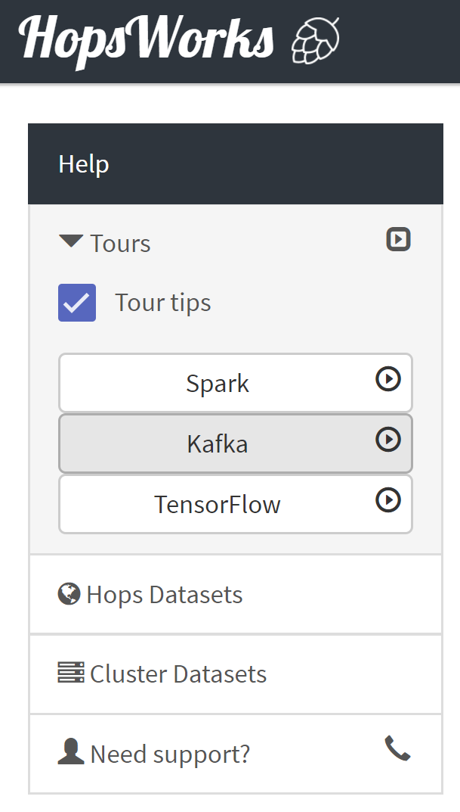

============
Apache Kafka
============

Hopsworks provides Kafka-as-a-Service for streaming applications.
Hopsworks provides by default the `HopsUtil`_ and `hops-util-py`_ libraries which make programming easier by abstracting away all the configuration boilerplate code such as Kafka endpoints, topics etc. Using these libraries, you can be up and running a simple Kafka on Hopsworks `in minutes`.

The following sections demonstrate different ways for writing Kafka applications on Hopsworks:

- Using the **Kafka service** on Hopsworks to setup Kafka topics in the cluster.
- Using the **Jobs service** on Hopsworks to submit jobs that produce/consume to/from Kafka.
- Using **Jupyter notebooks** on Hopsworks for producing/consuming to/from Kafka.

Our service is tightly coupled with our project-based model so only members of a project can use a specific Kafka topic, unless specified otherwise. The Kafka service on Hops is multi-tenant, allowing users to share topics between projects as desired.

Kafka Tour
----------

If users prefer to be guided through the rest of the guide in Hopsworks, they can
follow the `Kafka Tour` by selecting it from the available tours in the landing page.

.. _kafka-tour.png: ../../_images/kafka-tour.png

Example Spark Streaming Jobs with Kafka on Hopsworks
----------------------------------------------------

**Download and compile the example application**

You can download and compile a sample Spark streaming by following these steps:

* Step 1: run `git clone https://github.com/logicalclocks/hops-examples` to clone the example project
* Step 2: run  `cd hops-examples/spark/ && mvn package` to build the example project

**Create a Kafka topic and schema**

The next step is to create a Kafka topic that the sample spark streaming application will produce to and consume from. To create a topic, we use the Kafka service available in Hopsworks.

* Step 1: From the project box on the landing page, select a project
* Step 2: Click on the `Kafka` tab and the topics page will appear

.. _kafka-schemas.png: ../../_images/kafka-schemas.png
.. figure:: ../../imgs/kafka-schemas.png
    :alt: Kafka topics
    :target: `kafka-schemas.png`_
    :align: center
    :figclass: align-center

    Kafka topics & schemas

* Step 3: First we need to create a schema for our topic, so click on
  the `Schemas` tab and `New Avro Schema`. Copy the sample schema from below and paste it into the `Content` box. Then click on the `Validate`
  button to validate the schema you provided and then `Create`.

.. code-block:: JSON

    {
	"fields": [
		{
			"name": "timestamp",
			"type": "string"
		},
		{
			"name": "priority",
			"type": "string"
		},
		{
			"name": "logger",
			"type": "string"
		},
		{
			"name": "message",
			"type": "string"
		}
	],
	"name": "myrecord",
	"type": "record"
    }

* Step 4: Click on `New Topic`, give a topic name, select the
  schema you created at Step 3 and press `Create`.

**Advanced Kafka Topic Creation**

A Kafka topic by default will be accessible only to members of a
specific project. In order to *share* the topic with another project
click on the ``Kafka`` service from the menu on the left. This will
bring you to Kafka main page as illustrated below. Then press the
the ``Share topic`` button on the appropriate topic and select the
name of the project you would like to share with.

.. _kafka-main.png: ../../_images/kafka-main.png
.. figure:: ../../imgs/kafka-main.png
    :alt: Kafka main
    :target: `kafka-main.png`_
    :align: center
    :figclass: align-center

    Kafka main page

You can also fine grain access to Kafka topics by adding ACLs easily
through Hopsworks. Once you have created a Kafka topic, click on the
``Kafka`` service and then on the *Add new ACL* button.

When creating a new ACL you are given the following options:

* **Permission Type** - Whether you will *allow* or *deny* access
  according to the ACL you are about to create

* **Operation Type** - The operation this ACL will affect:

  * *read* : Read from the topic
  * *write* : Write to the topic
  * *detail* : Get information about this topic
  * \* : All above

* **Role** - The user role this ACL will affect. It can be *Data
  scientist*, *Data owner* or both.

* **Host** - Originating host of the request to read, write or detail

* **Project name** - The name of project this ACL concerns in case you
  have shared the topic with another project

* **Member email** - Email of the user that this ACL will apply or *
  for everybody

When you are done with the ACL parameters click on the `Create`
button.

As an example assume that we have already created a Kafka topic for
our project and we have shared this topic with another project named
`another_sample_project`. We would like members of the other project
**NOT** to be able to produce on this topic. Then the ACL would look
like the following.

.. _kafka-acl-example.png: ../../_images/kafka-acl-example.png
.. figure:: ../../imgs/kafka-acl-example.png
    :alt: Kafka acl example
    :target: `kafka-acl-example.png`_
    :align: center
    :figclass: align-center

    Kafka ACL example

If you would like to see more details about your Kafka topic click on
the ``Advanced view`` button. In the picture below we
can see that there are three ACLs. The first is the default ACL which
is applied when a topic is created. The second was created when we
shared the topic with another project, allowing full access and
finally the third is the custom ACL we created before.

.. _kafka-topic-details.png: ../../_images/kafka-topic-details.png
.. figure:: ../../imgs/kafka-topic-details.png
    :alt: Kafka topic details
    :target: `kafka-topic-details.png`_
    :align: center
    :figclass: align-center

    Kafka topic details

**Upload the compiled sample application and use it to create Spark jobs on Hopsworks**

* Step 1: Upload the jar file from `hops-examples/spark/target/` to a dataset. The jar is named: `hops-examples-spark-X.Y.Z-SNAPSHOT.jar`.

* Step 2: Click on the `Jobs` tabs at project menu and follow the instructions from the **Jobs** section. Create a new job for the Producer. Select `Spark` as job type and specify the jar file that you just uploaded. The name of the main class is `io.hops.examples.spark.kafka.StructuredStreamingKafka` and argument is `producer`. At the `Configure and create` tab, click on `Kafka` Services and select the Kafka topic you created at Step 4. Your job page should look like the following:

.. _kafka-producer.png: ../../_images/kafka-producer.png
.. figure:: ../../imgs/kafka-producer.png
    :alt: Kafka producer job
    :target: `kafka-producer.png`_
    :align: center
    :figclass: align-center

    Kafka producer job

* Step 3: We repeat the instructions on Step 6 for the Consumer job. Type a different job name and as argument to the main class
  pass `consumer /Projects/YOUR_PROJECT_NAME/Resources/Data`. The rest
  remain the same as the Producer job.

**Run the created producer/consumer jobs**
`Run` both jobs. While the consumer is running you can check its execution log. Use the Dataset browser to navigate to the directory `/Resources/Data-APPLICATION_ID/`. Right click on the file `part-00000` and *Preview* the content.

A sample output would look like the following:

.. _kafka-sink.png: ../../_images/kafka-sink.png
.. figure:: ../../imgs/kafka-sink.png
    :alt: Kafka ouput
    :target: `kafka-sink.png`_
    :align: center
    :figclass: align-center

    Kafka output

.. _here: https://github.com/logicalclocks/hops-examples/tree/master/spark/src/main/scala/io/hops/examples/spark/kafka
.. _HopsUtil: https://github.com/logicalclocks/hops-util
.. _hops-util-py: https://github.com/logicalclocks/hops-util-py

Example Python Notebook with Kafka Producer and Consumer
--------------------------------------------------------

You can find several example notebooks using kafka at hops_examples_.

In this section we will demonstrate how you can use a jupyter notebook and python to produce/consume kafka messages. In this section it is assumed that you have already created a Kafka topic named "test" to produce/consume from and that you have enabled anaconda (which comes with some pre-installed packages, including the python package `kafka-confluent`) in your project.

**Start Jupyter**

Start Jupyter by going to the Jupyter tab, selecting Spark(static or dynamic), filling in the system properties and pressing "Start".

**Create the new notebook**

Create a new notebook and paste the following

.. code-block:: python

    from hops import kafka
    from hops import tls
    from confluent_kafka import Producer, Consumer
    TOPIC_NAME = "test"
    config = kafka.get_kafka_default_config()
    producer = Producer(config)
    consumer = Consumer(config)
    consumer.subscribe(["test"])
    # wait a little while before executing the rest of the code (put it in a different Jupyter cell)
    # so that the consumer get chance to subscribe (asynchronous call)
    for i in range(0, 10):
    producer.produce(TOPIC_NAME, "message {}".format(i), "key", callback=delivery_callback)
    # Trigger the sending of all messages to the brokers, 10sec timeout
    producer.flush(10)
    for i in range(0, 10):
    msg = consumer.poll(timeout=5.0)
    if msg is not None:
        print('Consumed Message: {} from topic: {}'.format(msg.value(), msg.topic()))
    else:
        print("Topic empty, timeout when trying to consume message")

.. _hops_examples: https://github.com/logicalclocks/hops-examples
