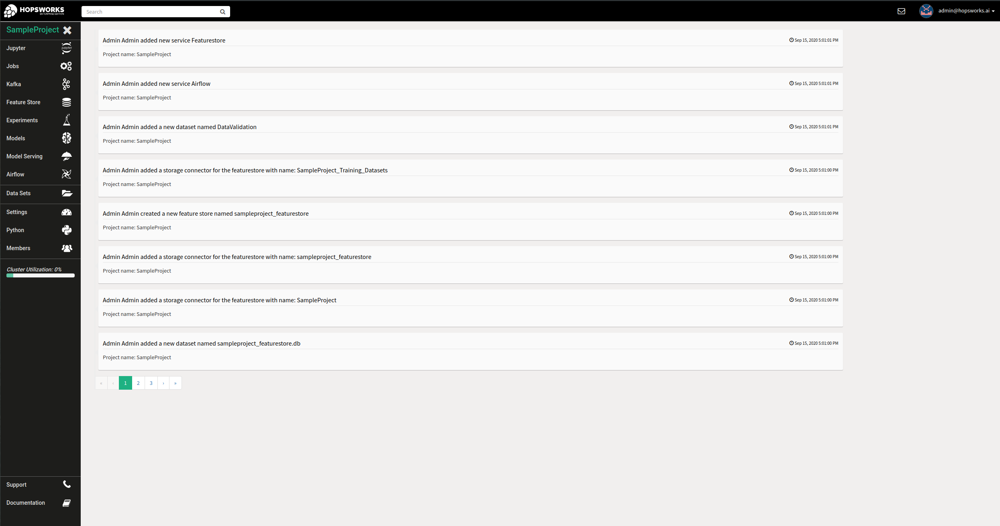
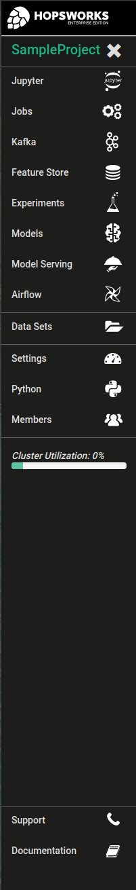

===========================
Create a New Project
===========================

You can create a project by clicking on the ``New`` button in the
*Projects* box. This will pop-up a dialog, in which you enter the
project name, an optional description, and select an optional set of
services to be used in the project. You can also select an initial set
of members for the project, who will be given the role of Data
Scientist in the project. Member roles can later be updated in the
Project settings by the `project owner` or a member with the `data owner` role. 
A valid project name can only contain characters a-z, A-Z, 0-9 and special
characters '_' and '.' but not '__' (double underscore). There are also reserved words that are not
allowed in project names. A complete list of reserved words can be found in section :ref:`Project name reserved words`.

As soon as you have created a new project and click on it on the
*Projects* box, you will see the project main page as illustrated in
the picture below.

.. _project-activity.png: ../../_images/projects/project-activity.png

    Project main page

    Project Menu

On the left-hand side of the project main page is the Project
Menu. On the top section are the currently active services for your
project such as the ``Job`` launcher UI and ``History
service``, ``Kafka`` etc In the middle
section is the ``Data Sets`` browser menu where you can explore your
project's datasets. Finally, on the bottom section is various settings
for the project. From the ``Settings`` menu you can modify the
description of the project, the data retention period and see some
statistics. From the ``Members`` menu you can add new members to your
project and share your datasets or remove existing ones. Using the
``Metadata Designer`` you can attach more intuitive metadata to your
project. Also, in the project's menu you can always see the current
cluster utilization.

Project name reserved words
============================

PROJECTS, HOPS-SYSTEM, HOPSWORKS, INFORMATION_SCHEMA, AIRFLOW, GLASSFISH_TIMERS, GRAFANA, HOPS, METASTORE, 
MYSQL, NDBINFO, PERFORMANCE_SCHEMA, SQOOP, SYS, GLASSFISH_TIMERS, GRAFANA, HOPS, METASTORE, MYSQL, NDBINFO, 
PERFORMANCE_SCHEMA, SQOOP, SYS, BIGINT, BINARY, BOOLEAN, BOTH, BY, CASE, CAST, CHAR, COLUMN, CONF, CREATE, CROSS, CUBE, CURRENT, CURRENT_DATE,
CURRENT_TIMESTAMP, CURSOR, DATABASE, DATE, DECIMAL, DELETE, DESCRIBE, DISTINCT, DOUBLE, DROP, ELSE, END,
EXCHANGE, EXISTS, EXTENDED, EXTERNAL, FALSE, FETCH, FLOAT, FOLLOWING, FOR, FROM, FULL, FUNCTION, GRANT, GROUP,
GROUPING, HAVING, IF, IMPORT, IN, INNER, INSERT, INT, INTERSECT, INTERVAL, INTO, IS, JOIN, LATERAL, LEFT, LESS,
LIKE, LOCAL, MACRO, MAP, MORE, NONE, NOT, NULL, OF, ON, OR, ORDER, OUT, OUTER, OVER, PARTIALSCAN, PARTITION,
PERCENT, PRECEDING, PRESERVE, PROCEDURE, RANGE, READS, REDUCE, REVOKE, RIGHT, ROLLUP, ROW, ROWS, SELECT, SET,
SMALLINT, TABLE, TABLESAMPLE, THEN, TIMESTAMP, TO, TRANSFORM, TRIGGER, TRUE, TRUNCATE, UNBOUNDED, UNION,
UNIQUEJOIN, UPDATE, USER, USING, UTC_TMESTAMP, VALUES, VARCHAR, WHEN, WHERE, WINDOW, WITH, COMMIT, ONLY,
REGEXP, RLIKE, ROLLBACK, START, CACHE, CONSTRAINT, FOREIGN, PRIMARY, REFERENCES, DAYOFWEEK, EXTRACT, FLOOR,
INTEGER, PRECISION, VIEWS, TIME, NUMERIC, SYNC, BASE, PYTHON37.

And any word containing _FEATURESTORE.