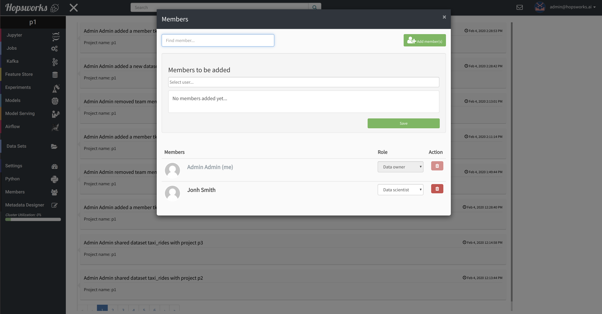

===========================
Project-based multi-tenancy
===========================

A project can be thought of as an abstraction combining three entities:

- Data
- Users
- Programs/Notebooks

A user in a project is called a ``member`` of the project and can carry one of two roles:

- Data Owner
- Data Scientist

**Data Owners** can perform all kinds of operations in project, most importantly invite users(members), create and share
Data Sets, delete data in a project.

**Data Scientists** are given mostly read-only access to Data Sets and are not allowed to invite other members. This
role is mostly useful for inviting members from other departments of an organization so they can apply their AI pipelines
and develop programs on the data that is owned by the Data Owners. Further information on Data Set access-control
see :ref:`Data Sets access control<data-set-access-control>`.

A Data Owner can invite other members by clicking ``Members`` on the left-hand side menu and then search by
first name, last name or username of the user to invite. The figure below shows a project **p1** with two members, a
Data Owner (Admin Admin) and a Data Scientist (John Smith). The role of a member can be altered at any time from the
same screen by any Data Owner.

.. _project-member-1.png: ../../_images/project-member-1.png
