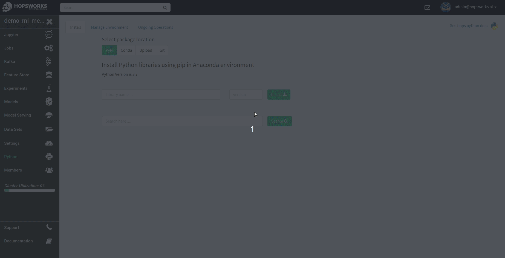
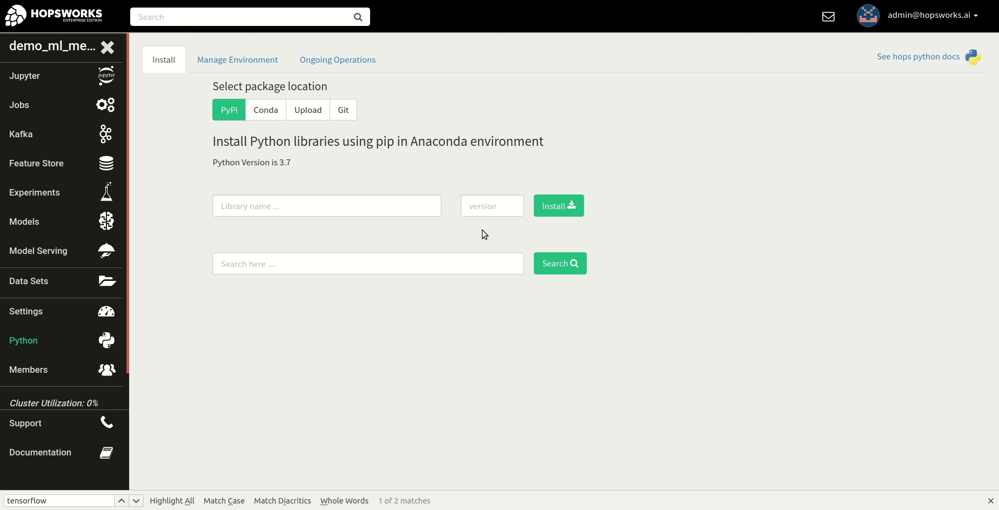
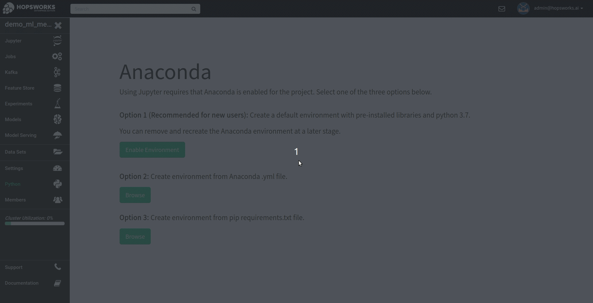

Python
======

This tutorial will go over how Python environments are managed.

Python Environment Basics
-------------------------

Hopsworks provides a premade environment for machine learning and data science development using python 3.7. The environment contain the most popular machine learning libraries including TensorFlow, Keras, PyTorch and scikit-learn.

The environment ensures compatibility between the CUDA version and the installed TensorFlow and PyTorch versions for applications using NVIDIA GPUs.

There is one Anaconda environment for each project, and the environment is layered on top of the project's base Docker image. That is, a library installed in the project's Anaconda environment can be used in a Job or Jupyter notebook (Python or PySpark) run in the project. In the Python UI, libraries can be installed or uninstalled from the project's Anaconda environment.

The Docker image is pulled on all hosts to ensure that the running application gets the latest version of the Anaconda environment, as libraries can be installed and uninstalled at any time in the project.

Navigating to the service
-------------------------

Managing the project python environment is provided as a service on Hopsworks and can be found on the landing page inside of a project.

.. _python1.gif: ../../_images/python/python1.gif
.. figure:: ../../imgs/python/python1.gif
    :alt: Open the Python service on Hopsworks
    :target: `python1.gif`_
    :align: center
    :figclass: align-center

    Open the Python service on Hopsworks

When a project is created, the python 3.7 environment is automatically enabled. So no manual steps are required to start developing your machine learning application.

Listing installed libraries
---------------------------

The preinstalled libraries are listed under the *Manage Environment* tab.

.. _python2.gif: ../../_images/python/python2.gif
.. figure:: ../../imgs/python/python2.gif
    :alt: List installed libraries
    :target: `python2.gif`_
    :align: center
    :figclass: align-center

    Installed libraries overview

Installing libraries
--------------------

Python packages can be installed from the following sources:

* PyPi, using pip package manager
* A conda channel, using conda package manager
* Packages saved in certain file formats, currently we support .whl or .egg
* A public or private git repository
* A requirements.txt file to install many libraries at the same time using pip

.. _python3.gif: ../../_images/python/python3.gif
.. figure:: ../../imgs/python/python3.gif
    :alt: Select library package manager
    :target: `python3.gif`_
    :align: center
    :figclass: align-center

    Select package manager

**Installation option 1: Install by name and version**

Enter the name and the desired version to install of your python package.

.. _python4.gif: ../../_images/python/python4.gif
.. figure:: ../../imgs/python/python4.gif
    :alt: Install library by name and version
    :target: `python4.gif`_
    :align: center
    :figclass: align-center

    Installing library by name and version

**Installation option 2: Search and install**

Enter the search term and select the version from the drop down.

.. _python5.gif: ../../_images/python/python5.gif
.. figure:: ../../imgs/python/python5.gif
    :alt: Install library using search
    :target: `python5.gif`_
    :align: center
    :figclass: align-center

    Installing library using the search

**Installation option 3: Install from .whl, .egg or requirements.txt file**

Select the uploaded package to install by selecting it in the file browser.

.. _python10.gif: ../../_images/python/python10.gif

    Installing package uploaded in the file browser

**Installation option 4: Install from .git repository**

To install from a git repository simply provide the repository URL. The URL you should provide is the same as you would enter on the command line using *pip install git+{repo_url}*.
In the case of a private git repository, also select whether it is a GitHub or GitLab repository and the preconfigured access token for the repository.

**Note**: If you are installing from a git repository which is not GitHub or GitLab simply supply the access token in the URL. Keep in mind that in this case the access token may be visible in logs for other users to see.

.. _python11.gif: ../../_images/python/python11.gif

    Installing a Python library using a git repository URL

**Track installation progress**

The progress of libraries being installed and uninstalled can be tracked in the *Ongoing Operations* tab.
The **CREATE** operation is the operation for creating a new Docker image based on the project's Anaconda environment, after that operation is finished the **INSTALL** operation will run and install the library in the new environment.

Uninstalling libraries
----------------------

To uninstall a library navigate to the *Manage Environment* tab and click *Uninstall* to remove the library.

.. _python6.gif: ../../_images/python/python6.gif
.. figure:: ../../imgs/python/python6.gif
    :alt: Uninstalling a library
    :target: `python6.gif`_
    :align: center
    :figclass: align-center

    Uninstalling a library

Recreating environment
----------------------

Sometimes it may be desirable to recreate the environment in case it ended up in a bad state. In order to do that, first click *Remove Environment* in the *Manage Environment* tab.
After removing the environment, simply recreate it by clicking *Enable Environment*

.. _python7.gif: ../../_images/python/python7.gif
.. figure:: ../../imgs/python/python7.gif
    :alt: Removing an environment
    :target: `python7.gif`_
    :align: center
    :figclass: align-center

    Remove the environment

Exporting an environment
------------------------

An existing anaconda environment can be exported as a yml file.

.. _python8.gif: ../../_images/python/python8.gif
.. figure:: ../../imgs/python/python8.gif
    :alt: Removing an environment
    :target: `python8.gif`_
    :align: center
    :figclass: align-center

    Exporting an environment

Create an environment from yml
------------------------------

An environment can be created from an Anaconda yml file.

.. _python9.gif: ../../_images/python/python9.gif
.. figure:: ../../imgs/python/python9.gif
    :alt: Create an environment from yml file
    :target: `python9.gif`_
    :align: center
    :figclass: align-center

    Create an environment from yml

Create an environment from requirements.txt
------------------------------

An environment can be created from a requirements.txt file.

.. _python12.gif: ../../_images/python/python12.gif

    Create an environment from yml
