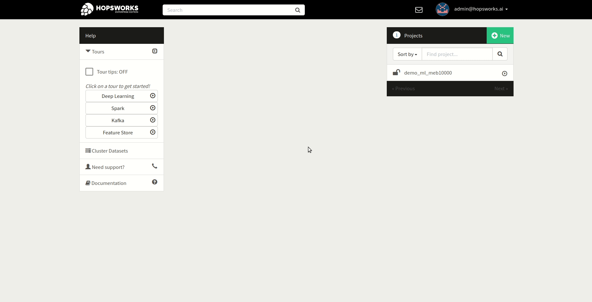
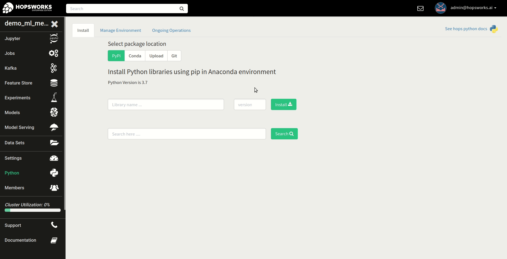
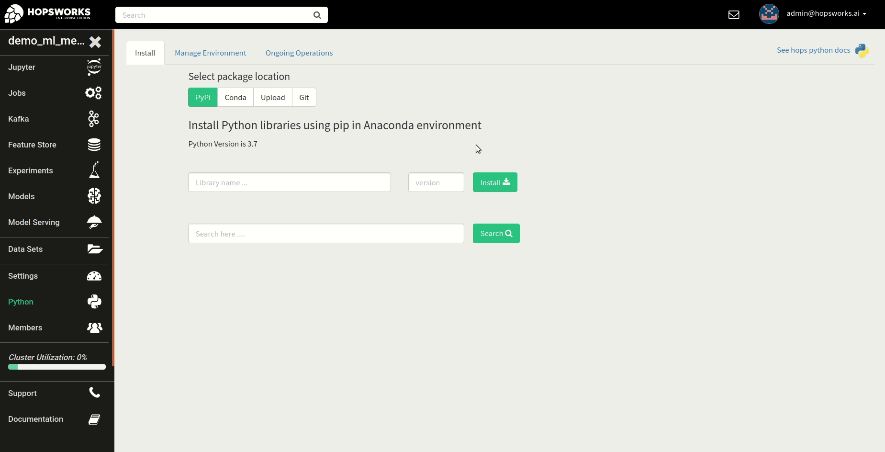
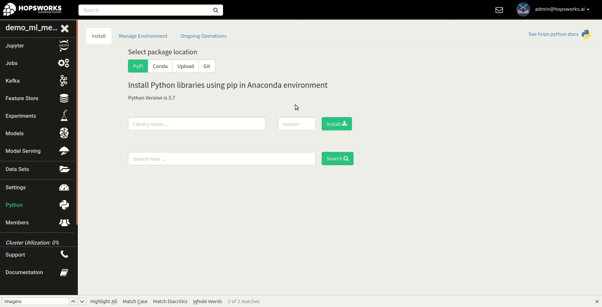
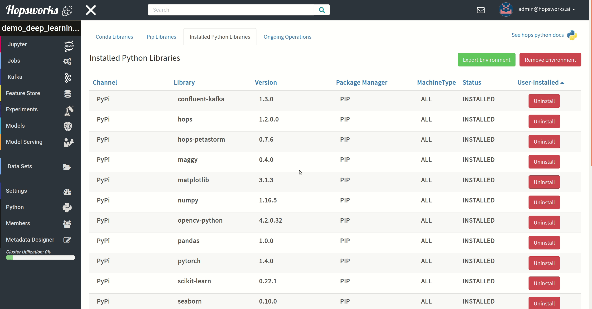
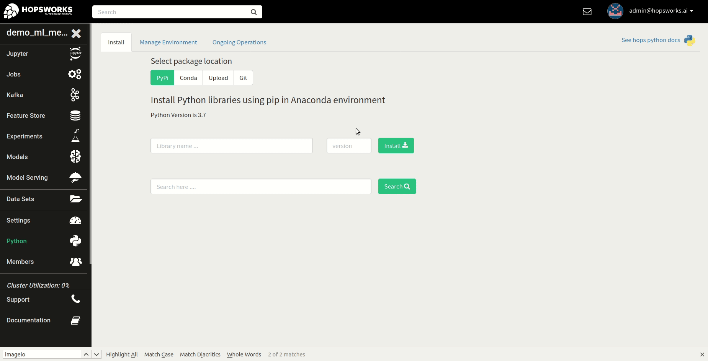
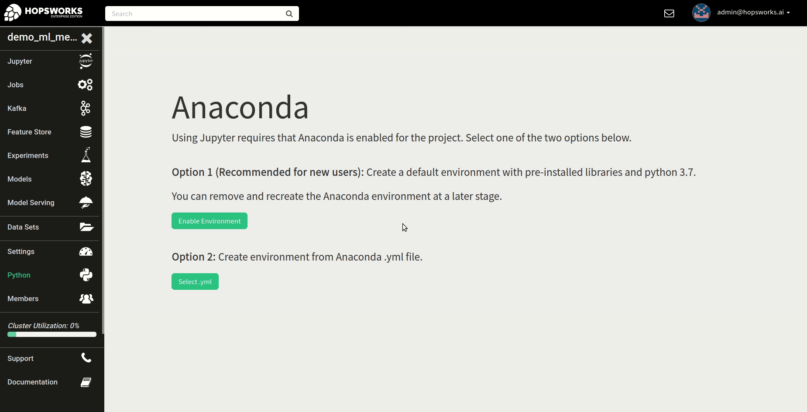

Python
======

This tutorial will go over how Python environments are managed.

Python Environment Basics
-------------------------

Hopsworks provides a premade environment for machine learning and data science development using python 3.7. The environment contain the most popular machine learning libraries including TensorFlow, Keras, PyTorch and scikit-learn.

The environment ensures compatibility between the machine learning libraries and CUDA/cuDNN in case of NVIDIA GPUs and ROCm in case of AMD GPUs.

In each project there is an Anaconda environment, which is replicated at all data processing hosts in the cluster. This means that whenever an operation is issued through the UI such as, installing or uninstalling a library, it is replicated on all the Anaconda environments which keeps them in sync.

Each python application running in the project, such as for example PySpark, uses the project's environment.

Navigating to the service
-------------------------

Managing the project python environment is provided as a service on Hopsworks and can be found on the landing page inside of a project.

.. _python1.gif: ../../_images/python/python1.gif

    Open the Python service on Hopsworks

When a project is created, the python 3.7 environment is automatically enabled. So no manual steps are required to start developing your machine learning application.

Listing installed libraries
---------------------------

The preinstalled libraries are listed under the *Manage Environment* tab.

.. _python2.gif: ../../_images/python/python2.gif

    Installed libraries overview

Installing libraries
--------------------

**Select package manager**

Python packages can be installed using either conda or pip package managers. For installing packages through conda click the *Conda Libraries* tab, and for pip click *Pip Libraries*.

The first installation or removal of a library will take longer than subsequent operations. The reason being that when a modification is made to the premade environment the first time, the environment is cloned. All subsequent operations will not involve cloning the environment.

.. _python3.gif: ../../_images/python/python3.gif

    Select package manager

**Installation option 1: Install by name and version**

Enter the name and the desired version to install of your python package.

.. _python4.gif: ../../_images/python/python4.gif

    Installing library by name and version

**Installation option 2: Search and install**

Enter the search term and select the version from the drop down.

.. _python5.gif: ../../_images/python/python5.gif

    Installing library using the search

**Track installation progress**

The progress of libraries being installed and uninstalled on all the replicated Anaconda environment can be tracked in the *Ongoing Operations* tab.
The **CREATE** operation is the operation for cloning the premade environment, after that operation is finished the **INSTALL** operation will run and install the library in the environment.

Uninstalling libraries
----------------------

To uninstall a library navigate to the *Manage Environment* tab and click the *Uninstall* button the the library to remove. Keep in mind that this will also clone the environment before actually performing the uninstall operation.

.. _python6.gif: ../../_images/python/python6.gif

    Uninstalling a library

Recreating environment
----------------------

Sometimes it may be desirable to recreate the environment in case it ended up in a bad state. In order to do that, first click *Remove Environment* in the *Manage Environment* tab.
After removing the environment select the python version to use in the new environment.

.. _python7.gif: ../../_images/python/python7.gif

    Remove the environment

Exporting an environment
------------------------

An existing anaconda environment can be exported as a yml file.

.. _python8.gif: ../../_images/python/python8.gif
.. figure:: ../../imgs/python/python8.gif
    :alt: Removing an environment
    :target: `python8.gif`_
    :align: center
    :figclass: align-center

    Exporting an environment

Create an environment from yml
------------------------------

An environment can be created from an Anaconda yml file.

.. _python9.gif: ../../_images/python/python9.gif

    Create an environment from yml
