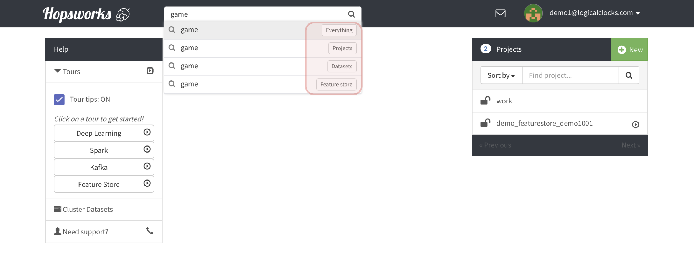
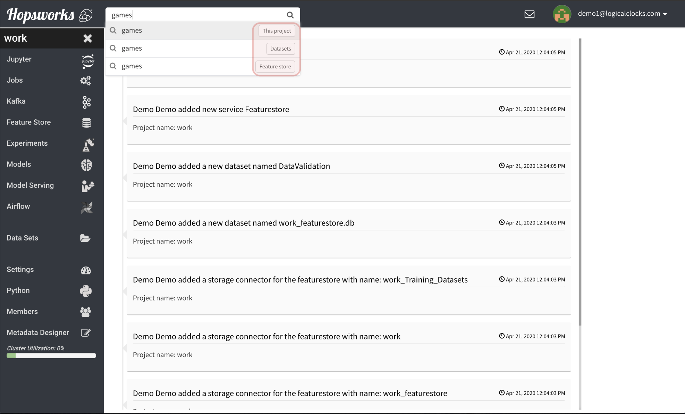
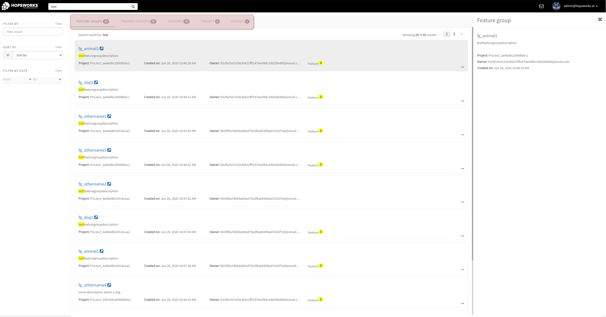
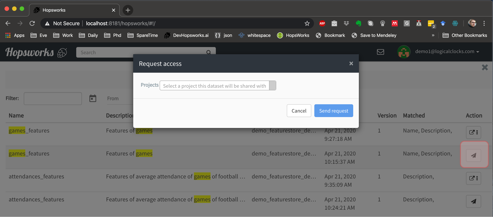
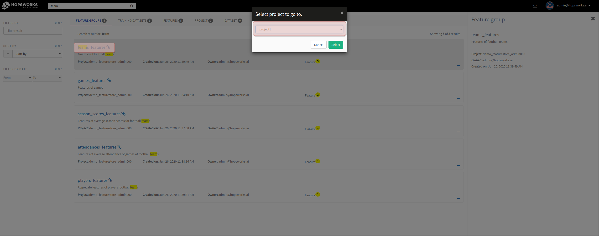

Search
========================

The search on the navigation bar can be used to search for Datasets, Feature groups, Features and Training datasets.
Depending on the page you are in, landing page or project dashboard, the search scope will cover all projects or the specific project you are in.

In the case of searching on the landing page, as we can see in the image above, your search will target all items that have not been marked explicitly as being private when they were create. By default all the metadata of items(Projects, Datasets, Feature Groups, Features, Training Datasets) are public and searchable by all users in the cluster. The data however is always private and requires access granting by the owners in order to have access to it. When searching globaly you can narrow your search to the categories: Projects/Datasets/Featurestore(Featuregroup, Features and Training Datasets) by selecting the appropriate drop down option.

In the case of searching in the project dashboard, your search will target all items that this project has access to (access to their data) - this includes items that were created within this project as well as items that have been shared with this project. When searching within the project you can narrow your search to the categories: Datasets/Featurestore(Featuregroup, Features and Training Datasets).

Search results are divided in four tabs:

* Featuregroup

* Training dataset

* Feature 

* Others (Datasets) 

Results will also have highlighted the reason why they matched your search query:

* Featuregroup
	* Name
	* Description
	* Tags
	* Features
* Training dataset
	* Name
	* Description
	* Tags
* Feature 
	* Name
* Others (Datasets) 
	* Name
	* Description
	* Metadata

When searching globally, if you discover an interesting item, you can click on the paper plane icon in order to send a request to have access to its data. When requesting access you need to provide a project that you want to save this shared item in. If the owner of the item accepts your request, you will now be able to access its contents from the project you selected.

When searching globally if you have access to a particular item, you can see the "goto" icon. In the case of shared items it can be the case that you can access this item from multiple projects, which is why you can select to which project you want to navigate to.
  