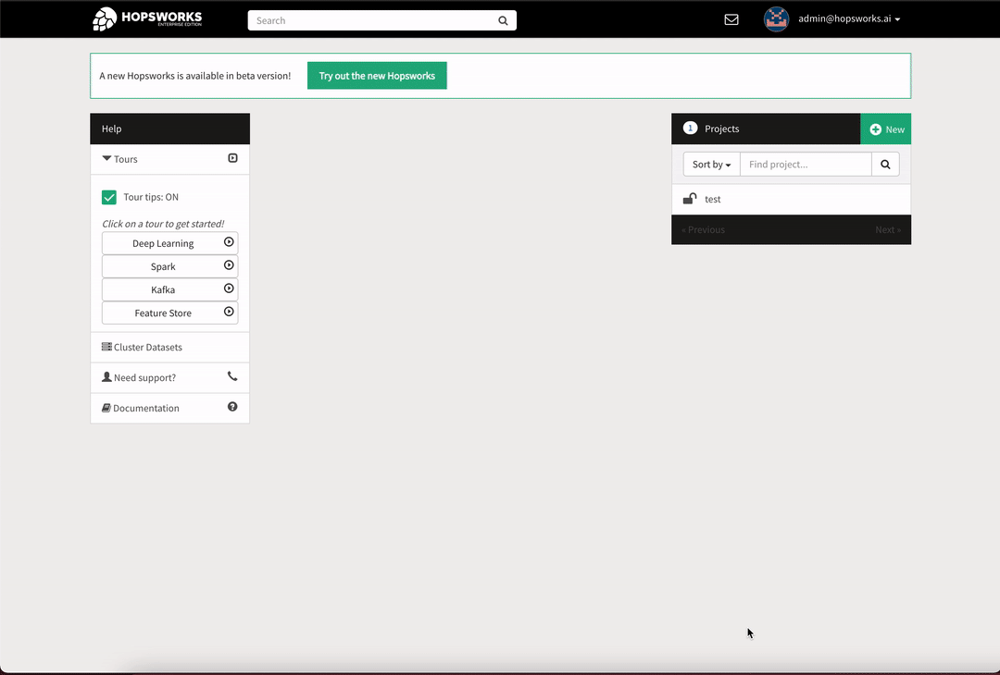

Tags
====

The feature store enables users to attach tags to artifacts, such as feature groups or training datasets. Tags are aditional metadata attached to your artifacts and thus they can be used for an enhanced full text search. Adding tags to an artifact provides users with a more dynamic metadata content that can be used for both storage as well as enhancing artifact discoverability.

**Note**: By default Hopsworks makes all metadata searchable, users can opt out for particular featurestores if they want to keep them private.

A tag is a {**key**: **value**} association, providing additional information about the data, such as for example geographic origin. This is useful in an organization as it adds more context to your data making it easier to share and discover data and artifacts.

**Note**: Tagging is only available in the enterprise version.

Tag Schemas
-----------
The first step is to define the schemas of tags that can later be attached. These schemas follow the https://json-schema.org as reference. The schemas define legal jsons and these can be primitives, objects or arrays. The schemas themselves are also defined as jsons.

Allowed primitive types are:

- string
- boolean
- integer
- number (float)

A tag of primitive type - string would look like:

.. code-block:: JSON

    { "type" : "string" }

and this would allow a json value of:

.. code-block:: JSON

    Private Information

We can also define arbitrarily complex json schemas, such as:

.. code-block:: JSON

    {
      "type" : "object",
      "properties" : {
        "first_name" : { "type" : "string" },
        "last_name" : { "type" : "string" },
        "age" : { "type" : "integer" },
        "hobbies" : {
          "type" : "array",
          "items" : { "type" : "string" }
        }
      },
      "required" : ["first_name", "last_name", "age"],
      "additionalProperties": false
    }

and a value that follows this schema would be:

.. code-block:: JSON

    {
      "first_name" : "John",
      "last_name" : "Doe",
      "age" : 27,
      "hobbies" : ["tennis", "reading"]
    }

**Properties** section of a tag is a dictionary that defines field names and types.

Json schema are pretty lenient, all that the properties section tells us, is that if a field appears, it should be of the appropriate type. If the json object contains the field `first_name`, this field cannot be of type `boolean`, it has to be of type `string`. What we emphasize here, is that the properties section does not impose that fields declared are mandatory, or that the json object cannot contain other fields that were not defined in the schemas.

**Required** section enforces the mandatory fields. In our case above `first_name`, `last_name`, `age` are declared as mandatory, while `hobbies` is left as an optional field.

**Additional Properties** section enforces the strictness of the schema. If we set this to `false` the json objects of this schema can only use fields that are declared (mandatory or optional) by the schema. No undeclared fields will be allowed.

Type object is the default type for schemas, so you can ommit it if you want to keep the schema short.

Advanced tag usage
------------------

We can use additional properties of schemas as defined by https://json-schema.org to enhance our previous person schema:

- Add a `$schema` section to allow us to use more advanced features of the json schemas defined in later drafts. The default schema draft is 4 and we will use 7 here (latest).
- Add an `id` field that is of type string but has to follow a particular regex pattern. We will also make this field mandatory.
- Set some rules on `age`, for example age should be an Integer between 0 and 150.
- Add an `address` field that is itself an object.

.. code-block:: JSON

    {
      "$schema": "http://json-schema.org/draft-07/schema#",
      "type" : "object",
      "properties" :
      {
        "id" : {
          "type" : "string",
          "pattern" : "^[A-Z]{2}[0-9]{4}$"
        },
        "first_name" : { "type" : "string" },
        "last_name" : { "type" : "string" },
        "age" : {
          "type" : "integer",
          "minimum" : 0,
          "maximum" : 150
        },
        "hobbies" : {
            "type" : "array",
            "items" : { "type" : "string" }
        },
        "address" : {
          "street" : { "type" : "string" },
          "city" : { "type" : "string" }
        }
      },
      "required" : ["id", "first_name", "last_name", "age"],
      "additionalProperties": false
    }

and a valid value for this new schema would be:

.. code-block:: JSON

    {
      "id" : "AB1234",
      "first_name" : "John",
      "last_name" : "Doe",
      "age" : 27,
      "hobbies" : ["tennis", "reading"],
      "address" : {
        "street" : "Vasagatan nr. 12",
        "city" : "Stockholm"
      }
    }

Basic tag usage
---------------
Our new Feature Store UI is aimed to ease the general use of tags by users and we thus currently support only basic tags usage there. Basic tag schemas allow only one level depth fields. So types of fields are limited to primitives or array of primitives. Basic schemas also only allow the `required` and `additionalProperties` sections.

Schemas are defined at a cluster level, so they are available to all projects. They can only be defined by a user with admin rights.

.. _create_schema.gif: ../../_images/tags/create_schema.gif
.. figure:: ../../imgs/tags/create_schema.gif
    :alt: Create tag schema
    :target: `create_schema.gif`_
    :align: center
    :figclass: align-center

Tags can be attached to datasets or file through the UI as we can see in the following figures.

.. _attach_tag_dataset.gif: ../../_images/tags/attach_tag_dataset.gif

.. _attach_tag_file.gif: ../../_images/tags/attach_tag_file.gif

Advanced tag usage
------------------
The full capabilities of the json schemas as defined by https://json-schema.org allows us to define tags of primitive type as well as arbitrarily complex json objects.

**Note**: You can only attach one tag value for a tag name. By calling the add operation on the same tag multiple times, you perform an update operation.
If you require attaching multiple values to a tag, like maybe a sequence, consider changing the tag type to an array of the type you just defined.

Attaching Tags to ML Artifacts
------------------------------
Tags can also be attached to ML artifacts: feature groups and training datasets, through the featurestore APIs, which you can check on the https://docs.hopsworks.ai/latest/generated/tags/.

You can also try our featurestore tags example in the notebooks populated by the `feature store tour` under notebooks `hsfs/tags` or on https://examples.hopsworks.ai/featurestore/hsfs/tags/feature_store_tags/.