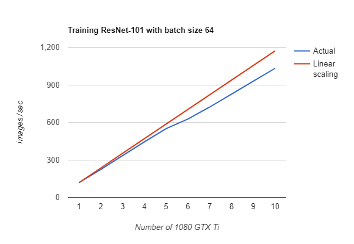

TensorFlow on Hops
==================

Hops provides support for running TensorFlow using HopsWorks on a Hops cluster. The environment for doing so is ran in Jupyter notebooks.
The datasets that you are working with can either be uploaded to your HopsWorks project or be shared among different projects the user has access to by sharing the actual datast. HopsFS is the filesystem of Hops, it is essentially a fork of Apache HDFS and is compliant with any API that can read data from an HDFS path, such as TensorFlow. In your TensorFlow code you can simply replace local file paths to the corresponding path in HDFS. More information is available `here <https://www.tensorflow.org/deploy/hadoop>`_..

Working with TensorFlow in Jupyter
----------------------------------
We currently support *three* different modes for running TensorFlow, that are meant for different purposes and use-cases:

1. Parallel TensorFlow experiments
2. Distributed TensorFlow with TensorFlowOnSpark
3. Optimal scalability with Horovod

To execute the Python code in YARN containers on the Hops cluster, we make use of `Apache Spark <https://spark.apache.org/>`_. to distribute and execute the code, so effectively we run TensorFlow on Spark. We also provide first-class support for TensorBoard, so you can easily monitor the progress of your training and compare different hyperparameter configurations while training or after a job has finished. And yes, we have logs too of course.

When starting Jupyter in HopsWorks, certain configuration properties need to be filled in and understood, therefore it is recommended to look at each guide to understand the implications of these values. Each of the links below guide you through the configuration properties that can be set for each mode.

Hops python library
-------------------
`hops` python library was developed to make it simple to run TensorFlow on Hops, scale-out training and increase productivity.
It contains several submodules that can be used for interacting with TensorBoard, GPUs, HopsFS and parallelizing training.

Mode 1. Parallel TensorFlow experiments
-----------------------------------------

The use-case of this mode is to run multiple parallel experiments where you have a set of predefined hyperparameters and a list of values per hyperparameter that should be used to run training with. Based on this list of hyperparameter values, a grid can be constructed (cartesian product). Each of these possible hyperparameter combinations in the grid corresponds to a TensorFlow job, or an "experiment". Running each of these hyperparameters configuration sequentially would be slow, therefore we provide a simple API to parallelize execution on one or more "executors".

Furthermore, we provide first-class support for the training as all the jobs can be visualized in the same TensorBoard in HopsWorks. Each TensorBoard logdir is then placed in your HopsWorks project, versioned with the hyperparameter values for that particular job.

Mode 2. Distributed TensorFlow with TensorFlowOnSpark
---------------------------------------------

Originally developed by Yahoo, TensorFlowOnSpark is essentially a wrapper for Distributed TensorFlow (https://www.tensorflow.org/deploy/distributed) and in that sense, TensorFlowOnSpark supports all features which Distributed TensorFlow provides, such as asynchronous or synchronous training.
Hops have since done some improvements since we have the ability to schedule GPUs, it is for example possible to define how many GPUs each worker should be allocated.

The `TFCluster` API remains the same, so any existing examples will run on TensorFlowOnSpark on Hops. We also provide TensorBoard for TensorFlowOnSpark to monitor the progress of your training.

Mode 3. Optimal scalability with Horovod
------------------------------------

Horovod is a distributed training framework for TensorFlow. The goal of Horovod is to make distributed Deep Learning fast and easy to use. Compared to TensorFlowOnSpark (Distributed TensorFlow), the programming model is significantly simpler, and it requires only a couple of changes to your existing code to convert a non-distributed training code to distributed and scale over 100s of GPUs.

