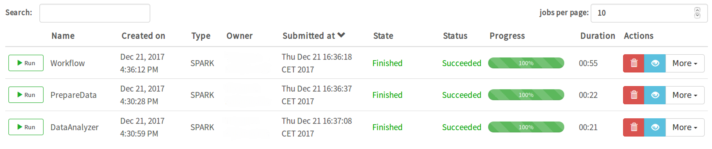
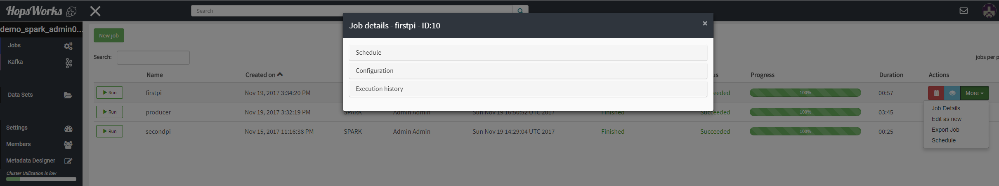

===========================
Workflows
===========================

.. _jobs: jobs.html
.. _HopsUtil: https://github.com/hopshadoop/hops-util 	
.. _javadoc: http://snurran.sics.se/hops/hops-util-javadoc/0.1.0/
.. _here: https://github.com/hopshadoop/hops-kafka-examples/blob/master/spark/src/main/java/io/hops/examples/spark/WorkflowManager.java

HopsWorks provides a way to programmatically build Spark Job Workflows by using `HopsUtil`_. To build a workflow, users need to do the following:

* Create the `jobs`_ that need to be part of the project's workflow.
* Create and run the *workflow* job, that is the one that implements and initiates the workflow.

API
============

`HopsUtil`_ provides a simple API (please consult HopsUtil `javadoc`_ for detailed information) to manage HopsWorks jobs. The API consists of the following two methods that accept a number of different parameters for more fine grained workflow management.

* **startJobs**: Gets a number of job IDs as input parameter and starts the respective jobs of the project for which the user invoking the jobs is also their creator. It can be used like ``HopsUtil.startJobs(1);``

* **waitJobs**: Waits for jobs (supplied as comma-separated job IDs) to transition to a *running* (default) state or *not running*, depending whether an optional boolean parameter is true or not. It can be used like ``waitJobs(1,5,11);``, which means the method will return when all three jobs with IDs 1,5,11 have finished running, or ``waitJobs(false, 1,5,11);`` which means the method will return when all jobs have entered the running state.

Example
=======

Suppose there are two jobs in a project that prepare and analyze data, *PrepareData* and *DataAnalyzer* respectively. A simple workflow would be to run the *PrepareData* first in order to clean up and transform some data to a format required by the analyzer. Once the *PrepareData* job is finished, we want the *DataAnalyzer* to start automatically. The ``WorkFlowManager`` code to build the workflow would look like:

.. code-block:: java
		
  //Start job with ID: 6145 that prepares data for job with id 6146
  HopsUtil.startJobs(6145);

  //Wait for job with ID: 6145 to complete
  HopsUtil.waitJobs(6145);

  //Start job with ID: 6146
  HopsUtil.startJobs(6146);

Source code for ``WorkflowManager`` is available `here`_.

The Job Service after running the workflow would look like the following image:

.. _workflow-example.png: ../../_images/workflow-example.png

    Job Service - Workflow Example

*Note that the API accepts job IDs instead of names, since different jobs can have the same name. To find the ID of a job, users need to click on the Job Details page shown in the following image*:

.. _job-details-id.png: ../../_images/job-details-id.png

    Job Details

