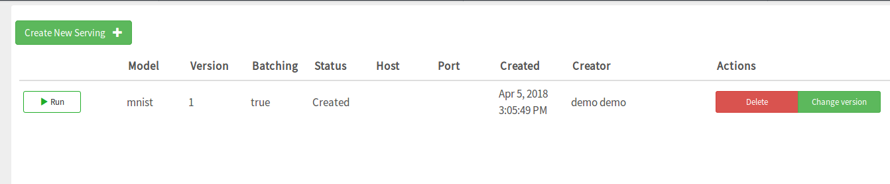
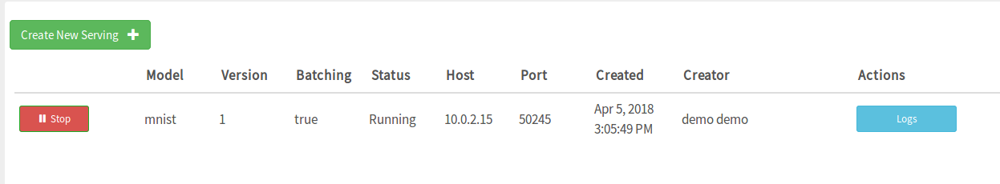

========================
TensorFlow Model Serving
========================
.. highlight:: python

Hopsworks supports TensorFlow Serving, a flexible, high-performance serving system for machine learning models, designed for production environments.

Export your model
-----------------

The first step to serving your model is to export it as a servable model. This is typically done using the SavedModelBuilder after having trained your model. For more information please see: https://www.tensorflow.org/serving/serving_basic

Model Serving in Hopsworks
--------------------------

**Step 1.**

The first step is to train and export a servable TensorFlow model to your Hopsworks project.

To demonstrate this we provide an example notebook which is also included in the TensorFlow tour.
https://github.com/hopshadoop/hops-examples/blob/master/tensorflow/notebooks/Serving/train_and_export_model.ipynb

In order to serve a TensorFlow model on Hopsworks, the .pb file and the variables folder should be placed in the Models dataset in your Hopsworks project. Inside the dataset, the folder structure should mirror what is expected by TensorFlow Serving.
   
.. _serving_structure.png: ../../_images/serving_structure.png
.. figure:: ../../imgs/serving_structure.png
   :alt: Expected file and folder structure for TensorFlow Serving
   :target: `serving_structure.png`_
   :align: center
   :figclass: align-center

**Step 2.**

The next step is to create a serving definition in the Hopsworks Model Serving service.
   
.. _model_serving.png: ../../_images/model_serving.png
.. figure:: ../../imgs/model_serving.png
   :alt: New serving definition
   :target: `model_serving.png`_
   :align: center
   :figclass: align-center
    

Click the Model button
        
.. _serving_definition.png: ../../_images/serving_definition.png
.. figure:: ../../imgs/serving_definition.png
   :alt: Create serving
   :target: `serving_definition.png`_
   :align: center
   :figclass: align-center
    
Select the .pb file in your Models dataset
   
.. _select_model.png: ../../_images/select_model.png
.. figure:: ../../imgs/select_model.png
   :alt: Select protobuf model
   :target: `select_model.png`_
   :align: center
   :figclass: align-center
    
Then select batching if it should be used and create your serving.

**Step 3.**

After having created the serving definition the next step is to start it.

.. _created_serving.png: ../../_images/created_serving.png

    
    
After having started successfully the endpoint and logs for the TensorFlow Model server is exposed in the interface.

.. _running_serving.png: ../../_images/running_serving.png

