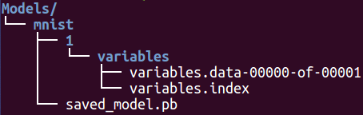
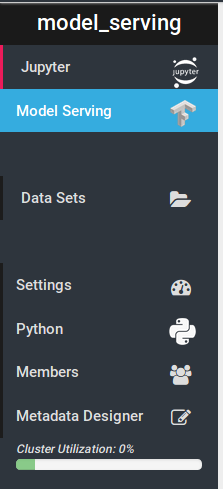
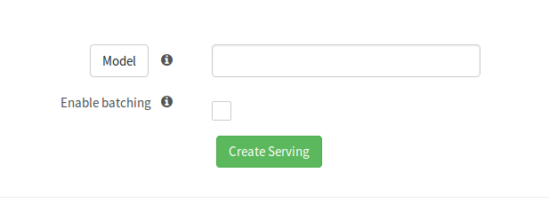
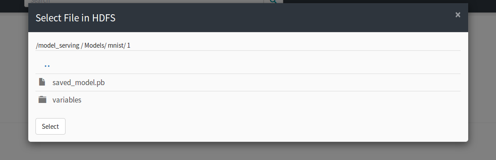

========================
TensorFlow Model Serving
========================
.. highlight:: python

HopsWorks supports TensorFlow Serving, a flexible, high-performance serving system for machine learning models, designed for production environments.

Export your model
-----------------

The first step to serving your model is to export it as a servable model. This is typically done using the SavedModelBuilder after having trained your model. For more information please see: https://www.tensorflow.org/serving/serving_basic

Model Serving in Hopsworks
--------------------------

**Step 1.**

The first step is to train and export a servable TensorFlow model to your Hopsworks project.

To demonstrate this we provide an example notebook which is also included in the TensorFlow tour.
https://github.com/hopshadoop/hops-examples/blob/master/tensorflow/notebooks/Serving/train_and_export_model.ipynb

In order to serve a TensorFlow model on HopsWorks, the .pb file and the variables folder should be placed in the Models dataset in your HopsWorks project. Inside the dataset, the folder structure should mirror what is expected by TensorFlow Serving.

**Step 2.**

The next step is to create a serving definition in the Hopsworks Model Serving service.

    
click "Model"
    

    
Select the .pb file in your Models dataset

