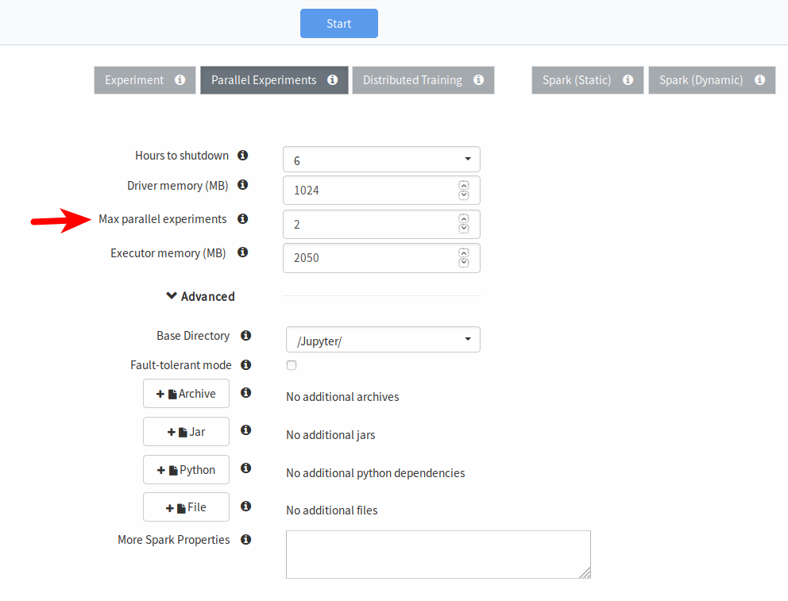

===============================
Parallel TensorFlow experiments
===============================

To be able to run your TensorFlow code on Hops, the code for the whole program needs to be provided and put inside a wrapper function. Everything, from importing libraries to reading data and defining the model and running the program needs to be put inside a wrapper function.

Hyperparameter optimization
---------------------------

Hyperparameter optimization is critical to achieve the best accuracy for your model. With Hops, hyperparameter optimization is easier than ever.

To define the hyperparameters, simply create a dictionary with the keys matching the arguments of your wrapper function, and a list of values for each hyperparameter.

::
  
    args_dict = {'learning_rate': [0.001, 0.0005, 0.0001], 'dropout': [0.45, 0.7]}

    def training(learning_rate, dropout):
        # Training code
        return training

Next step is to generate all possible combinations, the grid, of the hyperparameter values. First import the util module from the hops python library and call the grid_params function with your args dictionary.

::

    from hops import util
    args_dict_grid = util.grid_params(args_dict)

    print(args_dict_grid)

    {'learning_rate': [0.001, 0.001, 0.0005, 0.0005, 0.0001, 0.0001],
     'dropout': [0.45, 0.7, 0.45, 0.7, 0.45, 0.7]}

This length of each list is 6, which is interpreted as that you want to run 6 different hyperparameter combinations, where index 0 in each list maps to the hyperparameter values to use in job 0. Index 1 in each list would map to job 1, and so on.

.. csv-table:: Job number and hyperparameters
   :header: "Job number", "Learning rate", "Dropout"
   :widths: 20, 20, 10

   "1", "0.001", "0.45"
   "2", "0.001", "0.7"
   "3", "0.0005", "0.45"
   "4", "0.0005", "0.7"
   "5", "0.0001", "0.45"
   "6", "0.0001", "0.7"

Running the TensorFlow code
---------------------------

After defining the training code, and the hyperparameter combinations the next step is to start the actual training. This is done using the tflauncher module from the hops python library.

::

    from hops import tflauncher
    tflauncher.launch(spark, training, args_dict_grid)

As arguments it takes is simply the `spark` SparkSession object, which is automatically created when the first cell is evaluated in the notebook, in addition to the wrapper function and the dictionary with the hyperparameters. `tflauncher.launch` will simply run the wrapper function and inject the value of each hyperparameter that you have specified.

Increasing job throughput, making it parallel
---------------------------------------------
The default configuration is to run each job sequentially, so each one of the 6 jobs is run sequentially. It is possible to increase the number of jobs that can be executed at any time by increasing the value of the configuration property shown in the picture below. To do this you need to restart Jupyter, by navigating back to HopsWorks and shutting it down.

TensorBoard
-----------
In order to visualize the training in terms of accuracy and loss, we highly recommend that you make use of TensorBoard in your code to identify which hyperparameter combination produces the best model.

.. figure:: ../../imgs/visualize.png
    :alt: Visualizing previous runs
    :scale: 100
    :align: center
    :figclass: align-center

Where do I go from here?
------------------------

We have prepared several notebooks in the TensorFlow tour on HopsWorks with examples for running parallel experiments on Hops.
