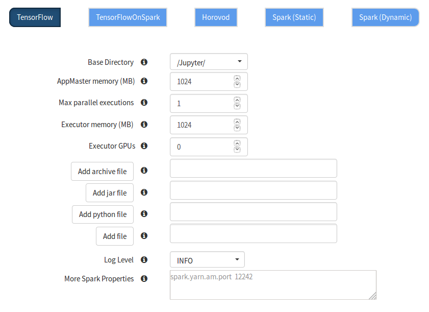

===============================
Parallel TensorFlow experiments
===============================
.. highlight:: python

The use-case of this mode is to run multiple parallel experiments where you have a set of *predefined hyperparameters* and a list of values per hyperparameter that should be used to run *training* with. Based on this list of hyperparameter values, a *grid* can be constructed (cartesian product). Each of these possible hyperparameter combinations in the grid corresponds to a TensorFlow job, or an *experiment*. Running each of these hyperparameters configurations sequentially would be slow, therefore we provide a simple API to run jobs in parallel. Each job runs on a Spark executor.

Jupyter configuration
#####################

When configuring Jupyter, it is important to understand the configuration properties that are being set to achieve optimal training time.

**Max parallel executions**

Defines how many TensorFlow jobs may be run at any time. If you have specified 100 different hyperparameter configurations, this implies 100 TensorFlow jobs. Each job being one hyperparameter combination. If this configuration value is set to 1, then each of these 100 jobs are run sequentially. Any value greater than 1 will mean that jobs are being parallelized, so 2 or more jobs may be run in parallel.

**Executor memory (MB)**

Defines the amount of memory each executor should be allocated with. Keep in mind that if your TensorFlow code is using a lot of memory, the job will be killed by YARN. You will have to restart Jupyter and increase this setting.

**Executor GPUs**

Defines how many GPUs should be allocated for each executor, effectivetly how many GPUs each job will be able to access. To run only with CPU, simply set this value to 0.

   
    
The programming model: Wrap your TensorFlow code in a function
##############################################################

To be able to run your TensorFlow code on Hops, the code for the whole program needs to be provided and put inside a wrapper function. Everything, from importing libraries to reading data and defining the model and running the program, needs to be put inside a wrapper function. The arguments of the wrapper function would map directly to the name of your hyperparameters.

::

    # Hyperparameter are learning rate and dropout
    def training(learning_rate, dropout):
        # TensorFlow training code (including reading data, defining model, starting training...)

Reading from HopsfS (HDFS)
#################

**Step 1**. The first step is to upload a dataset to your project in HopsWorks. After having uploaded the dataset, your TensorFlow input pipeline code must point to the path in HopsFS where that particular dataset is stored. The first step is to get the root path to your project in HopsFS. This is easily done by the code below.

::

    ... TensorFlow code ...

    from hops import hdfs
    project_root_path = hdfs.project_path()

    ... TensorFlow code ...
    
The path returned is to the root directory in HopsWorks.

.. figure:: ../../imgs/datasets-browser.png
    :alt: HopsWorks project path
    :scale: 100
    :align: center
    :figclass: align-center

**Step 2**. Append the relative path of your dataset to the root path. Assuming you uploaded a file named ``train.tfrecord``s in the Resources dataset, the path pointing to that particular dataset would then be.

::

    ... TensorFlow code ...

    from hops import hdfs
    project_root_path = hdfs.project_path()
    tfrecords_dataset = project_root_path + "Resources/train.tfrecords"

    ... TensorFlow code ...

**Step 3**. Use the path as any other path in a TensorFlow module

::

    ... TensorFlow code ...
    
    dataset = tf.data.TFRecordDataset(tfrecords_dataset)
    
    ... TensorFlow code ...

Hyperparameter optimization
---------------------------

Hyperparameter optimization is critical to achieve the best accuracy for your model. With Hops, hyperparameter optimization is easier than ever.

To define the hyperparameters, simply create a dictionary with the keys matching the arguments of your wrapper function, and a list of values for each hyperparameter.

::
  
    args_dict = {'learning_rate': [0.001, 0.0005, 0.0001], 'dropout': [0.45, 0.7]}

    def training(learning_rate, dropout):
        # Training code

Next step is to generate all possible combinations, the grid, of the hyperparameter values. First import the ``util module`` from the hops python library and call the ``grid_params`` function with your args dictionary.

::

    from hops import util
    args_dict_grid = util.grid_params(args_dict)

    print(args_dict_grid)

    {'learning_rate': [0.001, 0.001, 0.0005, 0.0005, 0.0001, 0.0001],
     'dropout': [0.45, 0.7, 0.45, 0.7, 0.45, 0.7]}

The length of each list is 6, which is interpreted as if you want to run 6 different hyperparameter combinations, where index 0 in each list maps to the hyperparameter values to use in job 0. Index 1 in each list would map to job 1, and so on.

.. csv-table:: Job number and hyperparameters
   :header: "Job number", "Learning rate", "Dropout"
   :widths: 20, 20, 10

   "1", "0.001", "0.45"
   "2", "0.001", "0.7"
   "3", "0.0005", "0.45"
   "4", "0.0005", "0.7"
   "5", "0.0001", "0.45"
   "6", "0.0001", "0.7"

Running the TensorFlow code
---------------------------

After defining the training code and the hyperparameter combinations the next step is to start the actual training. This is done using the *tflauncher* module from the hops python library.

::

    from hops import tflauncher
    tflauncher.launch(spark, training, args_dict_grid)

Its input argument is simply the `spark` SparkSession object, which is automatically created when the first cell is evaluated in the notebook, in addition to the wrapper function and the dictionary with the hyperparameters. `tflauncher.launch` will simply run the wrapper function and inject the value of each hyperparameter that you have specified.

Working with TensorBoard
########################

When you run your job using tflauncher, TensorBoard will be started automatically. To interact with TensorBoard, import the tensorboard module from the hops python library. In addition to writing summaries and your TensorBoard events of course.

::

    ... TensorFlow code ...

    from hops import tensorboard
    logdir = tensorboard.logdir()

    ... TensorFlow code ...
    
**Navigate to TensorBoard in HopsWorks**
After launching your job using tflauncher, you can monitor training by observing the TensorBoard.

.. figure:: ../../imgs/jupyter.png
    :alt: Jupyter UI overview
    :scale: 100
    :align: center
    :figclass: align-center

.. figure:: ../../imgs/overview.png
    :alt: Jupyter UI overview
    :scale: 100
    :align: center
    :figclass: align-center

Execution Logs
########################

**Navigate to Logs in HopsWorks**
After launching your job using tflauncher, you can navigate to HopsWorks to view execution logs.

.. figure:: ../../imgs/logs.png
    :alt: Logs overview
    :scale: 100
    :align: center
    :figclass: align-center

.. figure:: ../../imgs/viewlogs.png
    :alt: View logs
    :scale: 100
    :align: center
    :figclass: align-center

Where do I go from here?
------------------------

We have prepared several notebooks in the TensorFlow tour on HopsWorks with examples for running parallel experiments on Hops.
